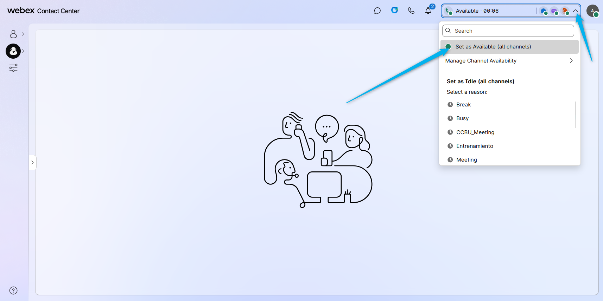
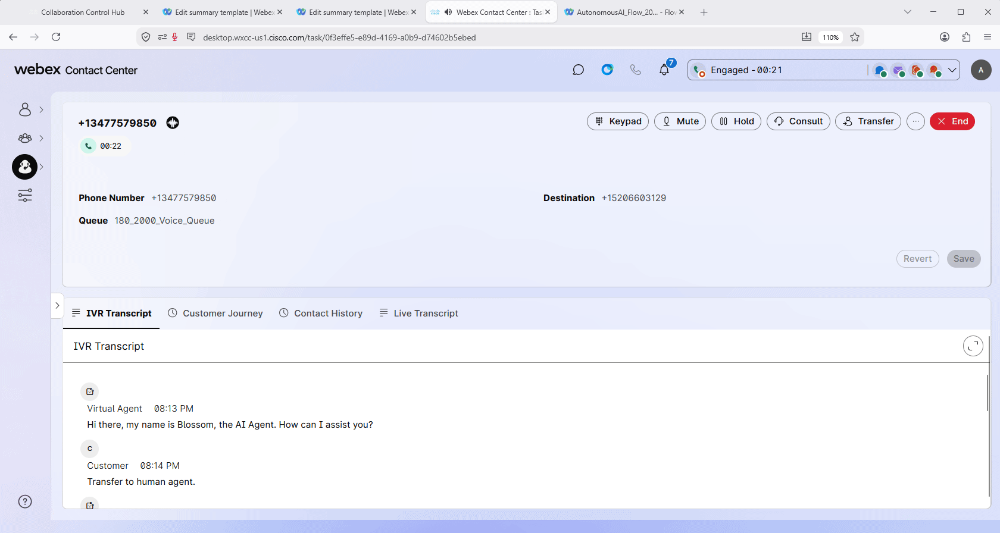

# Mission 1: Review AI Memory in Customer Journey

## Feature Description

**Webex AI Memory** lets the human agent see notes in the **Customer Journey** module on the Agent Desktop from previous interactions with this caller. The agent can use that context to give a better customer experience without asking the customer to repeat information.

## Mission overview

Your mission is to:

1. Place a test call and, on the Agent Desktop, open the **Customer Journey** module to see details from previous interactions with this caller.
2. If there is no information, keep the call running for a minute and simulate a flower-order conversation that contains more than 40 words. Then call again and check whether the **Customer Journey** module shows details about previous interactions.

---

## Build

### Task 1. Place a test call and open Customer Journey

1. Make sure your **Agent Desktop** is open and you are in the **Available** status.
   

2. Place a test call to the number associated with your **<copy><w class="attendee"></w>\_2000_Channel</copy>**. During the conversation with the AI agent, ask to talk to a human agent.

3. Answer the call on the Agent Desktop. Open the **Customer Journey** module and check whether it shows notes or details from previous interactions with this caller.
   

4. If the **Customer Journey** module does not show information yet, keep the current call running for about **one minute** and simulate a conversation in which you are ordering flowers. Speak more than **40 words** so AI Memory has enough context to store. You can use the sample below. Then disconnect the call, complete wrap-up, place a second test call, connect to the human agent again, and open the **Customer Journey** module. You should now see details about the previous interaction with this caller.

    Conversation sample: **<copy>I would like to order two dozen red roses for my anniversary this Saturday. I prefer delivery to my home in the afternoon, not pickup. Last time the delivery arrived too late, so please make sure this order is confirmed and sent with an SMS. I also need a small thank-you note with the flowers.</copy>**

<strong>Congratulations, you have officially completed this mission! 🎉🎉 </strong>

