# Mission 1: AI Agent Transfer Summary and Wrap-up Summary

## Feature Description

AI Agent Transfer Summary enhances agent efficiency and elevates customer experiences.

When a customer calls the contact center and interacts with an AI Agent, they may request to speak with a live human agent at some point during the conversation. Once connected to an agent, it is important for the agent to receive a concise summary of the customer's interaction with the AI Agent. This summary provides the agent with a quick overview of the customer's call reason.

The Webex Contact Center **Wrap-up Summary** feature automatically generates conversation summaries based on the interactions between the agent and the customer. It helps agents by summarizing the conversation and recommending next actions, reducing manual effort and improving accuracy in post-call documentation.

## Mission Details

Your mission is to:

1. Review the Generative Summary AI Assistant feature configurations
2. Test a smooth handoff to live human agent from AI Agent.
3. Test Wrap-up Summary after the agent completed the call.

## Configuration overview

### (<strong>Read Only</strong>) Task 1. Order Provisioning & Collaboration Control Hub Settings.

This task is read only. Read until Task 2.

1. You should have the AI Assistant SKU **A-FLEX-AI-ASST** from CCW provisioned in the tenant.

2. Once you have provisioned it, admins with the appropriate profile and access controls will be able to see the AI Assistant menu in Collaboration Control Hub. From there, the customer can enable/disable the **Virtual Agent Transfer Summary** feature from the Collaboration Control Hub.
   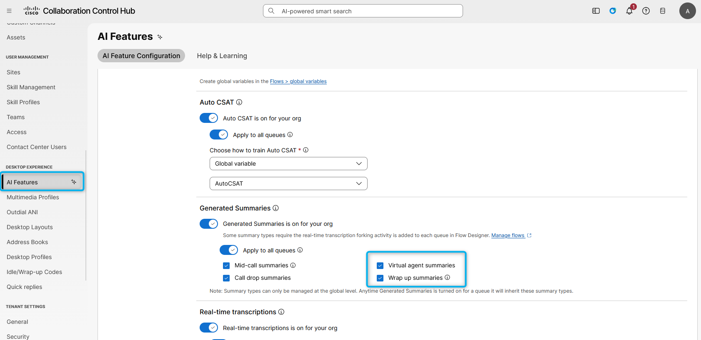

3. The Agent needs to be logged in to the Team that is configured with Desktop Layout that has "ai-assistant" features configured
   (**Note: Default desktop layout already includes the AI Agent Assistance widget**).  
    Agents Team:
   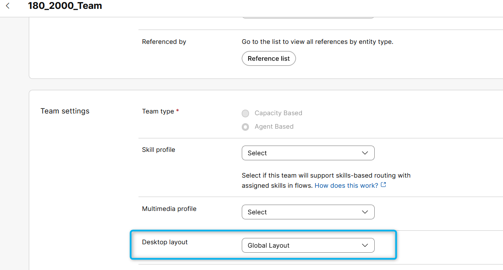
     Desktop Layout file: Make sure **ai-assistant** is configured under the **advancedHeader** in case you are using a custom Layout file.
   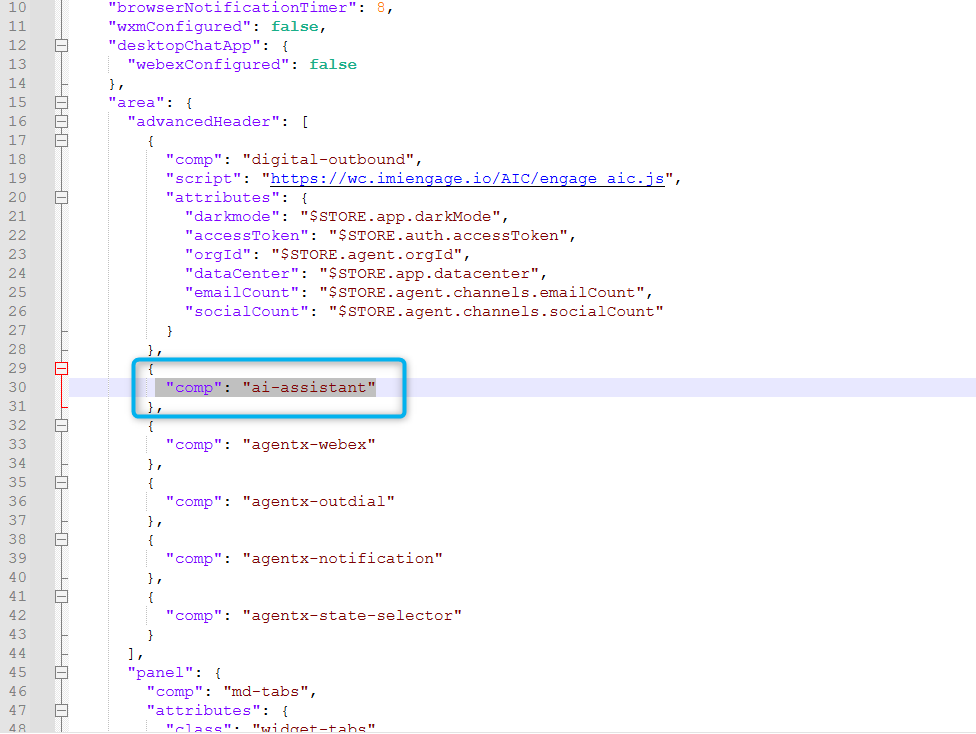
    The latest Default Desktop Layout is already configured for the AI Assistant feature. But if you use a custom Desktop layout in your tenant, you need to consider that this setting needs to be added.

### Task 2. Test Agent Handoff Configurations

1. Go to **Collaboration Control Hub** and from **Overview > Quick Links**, select **Desktop** option. Select **Desktop** endpoint option and choose the team **<copy><w class="attendee"></w>\_2000_Team</copy>**. Click **Save and Continue**. Allow browser to access Microphone by clicking **Allow** on every visit.
   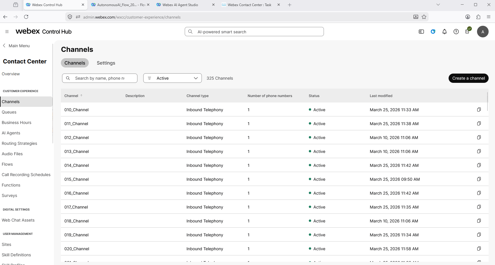

2. Make your Agent **Available** and you're ready to make a call.
   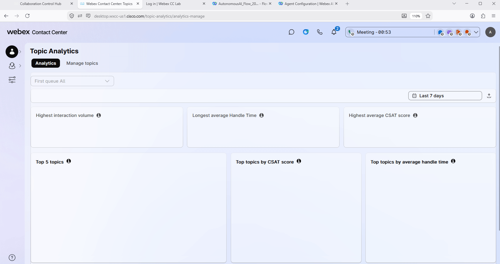

3. Dial the support number assigned to your **<w class="attendee"></w>\_2000_Channel** channel, and during the conversation with the AI agent, ask to **talk to a representative or live agent**.

4. (<strong>Read Only</strong>) By default, the **Conversation Transcripts** setting is enabled in the VirtualAgentV2 block.
   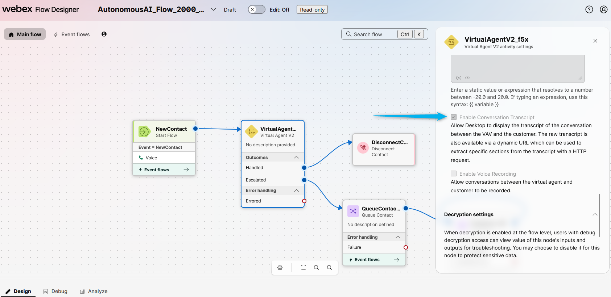

5. With this setting enabled, the live agent can see the conversation details between the caller and the AI agent. Please check if you can view the IVR transcripts during your test calls with Agent Handoff.
   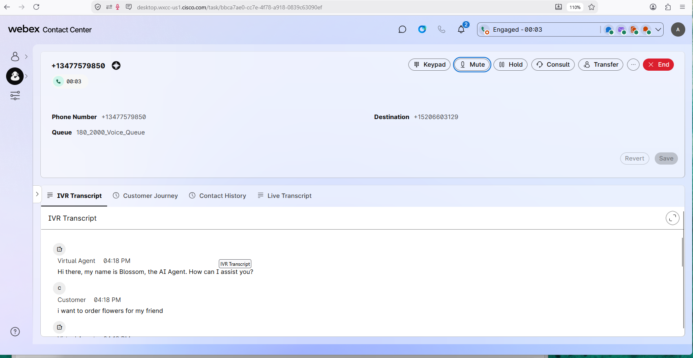

6. Answer the call on your Agent Desktop. You will see a window with the message **"AI agent transfer summary is ready"** pop up. You can click on **View Summary** from the window.
   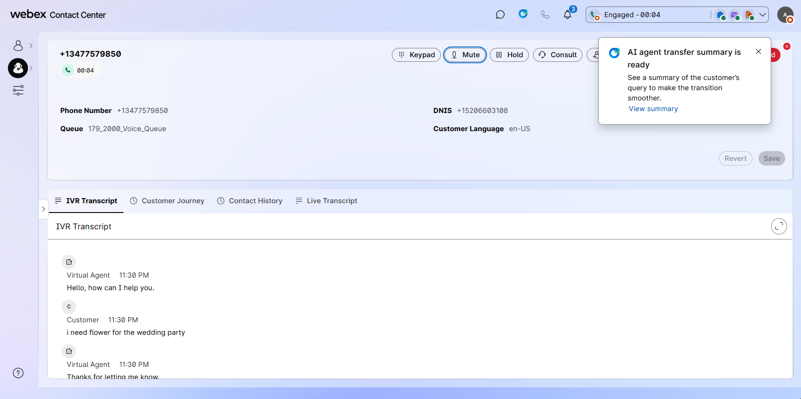

7. The **AI agent transfer summary is ready** notification will disappear after a few seconds. However, you can always reopen it by clicking on the AI Assistant widget.
   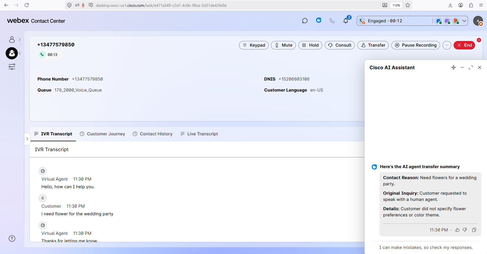

8. The human agent also receives the AI Agent Summary and, after the call, the Wrap Up Summary as part of the AI Assistant portfolio.
   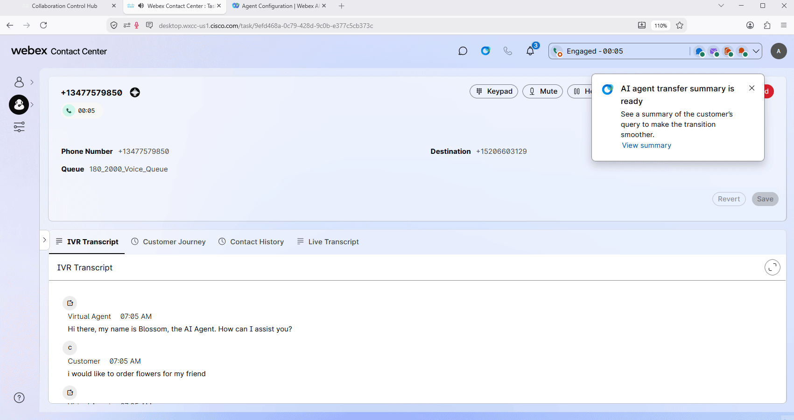

### Task 3. Test Wrap-up Summary Feature

1. Make sure the agent is in the **Available** status.
   

2. Place a call to your channel. Answer the call by the agent and put the agent on mute if you are using a Webex phone, as we use one microphone for both the caller and agent. As the customer, say that you ordered flowers but didn't receive a delivery.
   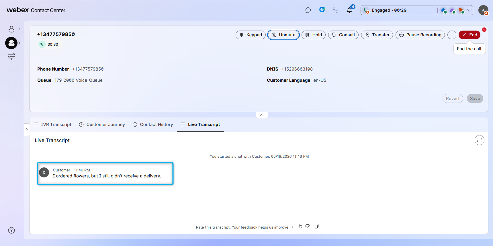

3. Disconnect the call. You should see the wrap-up code suggestion and the wrap-up summary of the call.
   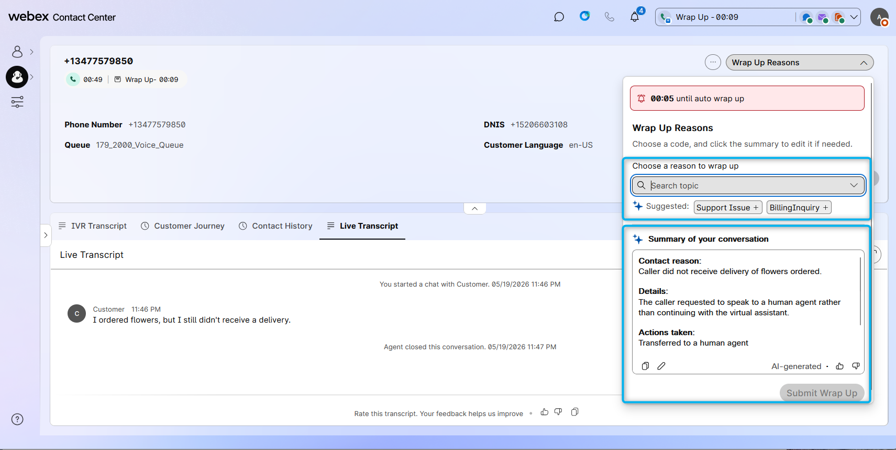

<strong>Congratulations, you have officially completed this mission! 🎉🎉 </strong>

