# Mission 2: Wrap-up custom template

## Feature Description

**Summary templates** let you control how Cisco AI Assistant generates interaction summaries. You can tailor the format and content for each summary type so agents and supervisors receive the context they need.

- **Wrap-Up Summary (PCS = post-call summary)** — A post-interaction summary automatically generated for agent review and CRM handoff, significantly reducing after-call work time.
- **Mid-Call Transfer / Consult Summary (MCS)** — Generates an in-progress summary during active interactions so receiving human agents or supervisors can immediately understand context without delay.
- **Virtual / AI Agent Handoff Summary (VAH)** — Summarizes prior AI agent interactions and passes full context to human agents, eliminating customer repetition and accelerating resolution.
- **Call Drop Summary (CDS)** — Preserves complete interaction context when a call disconnects unexpectedly, allowing agents to resume with full history intact.

You can also choose how the summary is generated:

- **Standalone summary generation**
- **Action level summary generation**
- **Post execution**
- **Generate summary and transfer**

In this mission, you will create a custom **Wrap-Up Summary (PCS)** template and assign it to your voice queue.

## Mission overview

Your mission is to:

1. Configure a custom Wrap-up Summary Template in the AI Studio.
2. Assign the custom template to your queue.

---

## Build

### Task 1. Configure Summary Templates in the AI Studio

1. In [Collaboration Control Hub](https://admin.webex.com){:target="_blank"} under **Contact Center**, go to **Overview** and open **Webex AI Agent**.
   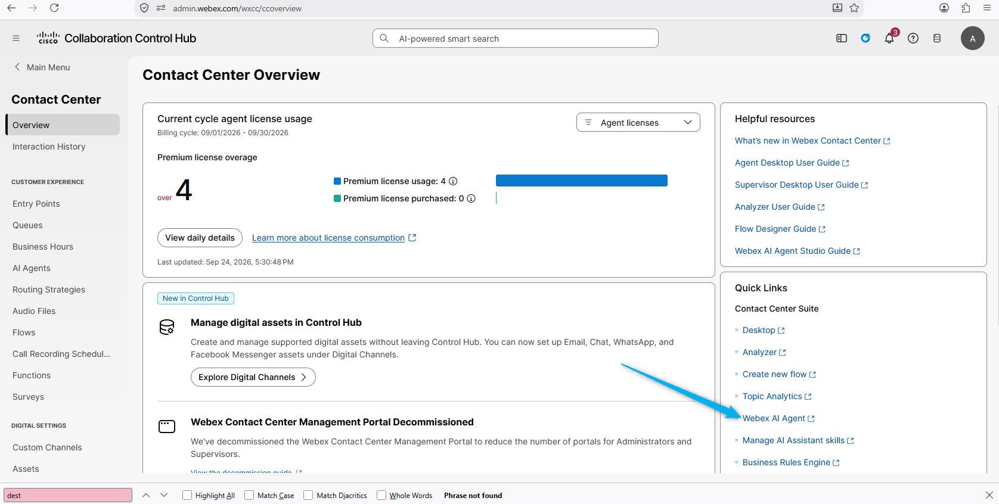

2. From the left-hand side menu, select **Summary Templates** and click **Create**.
   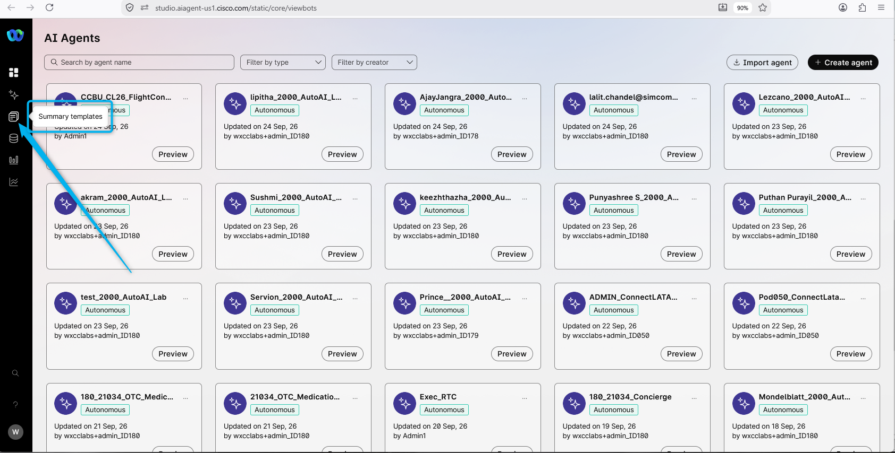

3. Click on **Create Template**.
   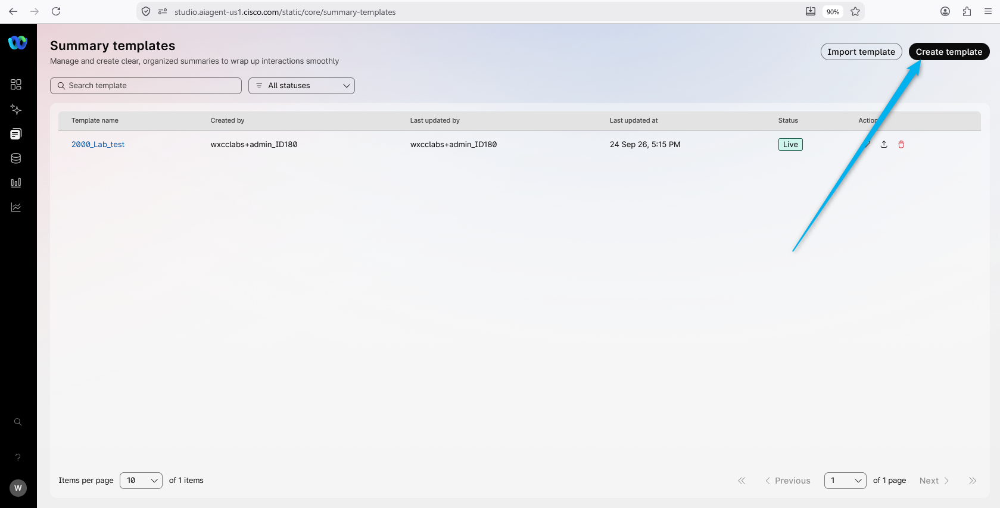

4. Configure the template with Name: **<copy><w class="attendee"></w>\_2000_Wrapup_Template</copy>**
   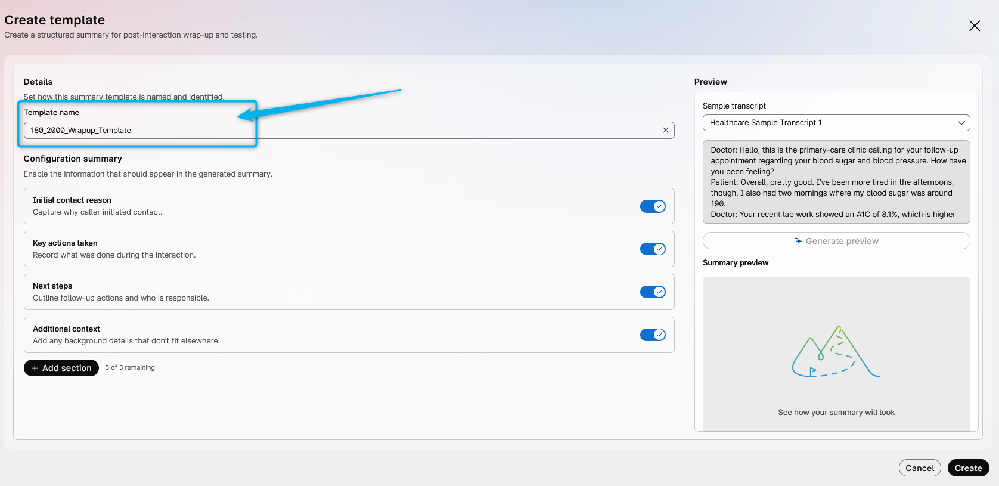

5. (<strong>Read Only</strong>) By default, you will see the sections that are currently used to generate the Wrap-up summary. You can enable or disable them based on your needs.
   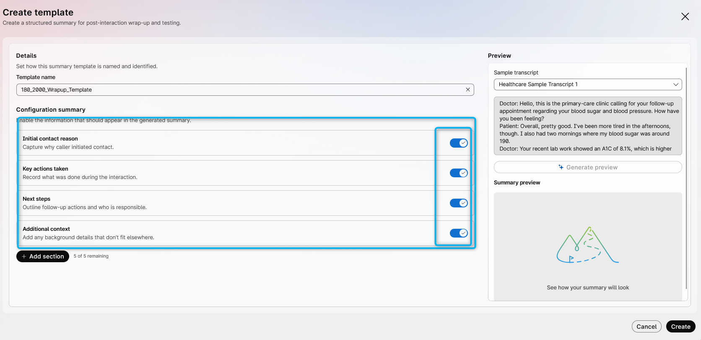

6. Click on **Add section** in order to add a custom section for what you want to see in the Wrap-up summary.
   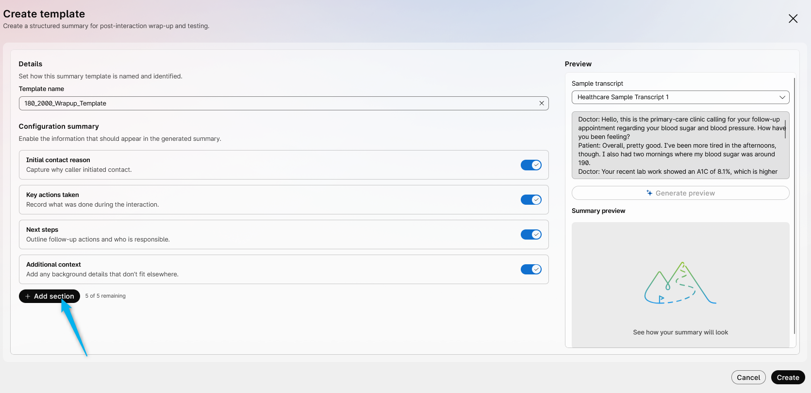

7. Configure the custom section with the following:

    - Title: **<copy>Delivery details</copy>**
    - Instructions: **<copy>Check whether the customer requested delivery or pickup. If the customer requested delivery, include the delivery details in the order summary. If the order is for pickup, clearly state that the order is for pickup.</copy>**
    - Example (optional): **<copy>The customer needs the delivery. The address is 125 Green Alder, Cary, NC, 25578</copy>**
    - Click on **Create**
       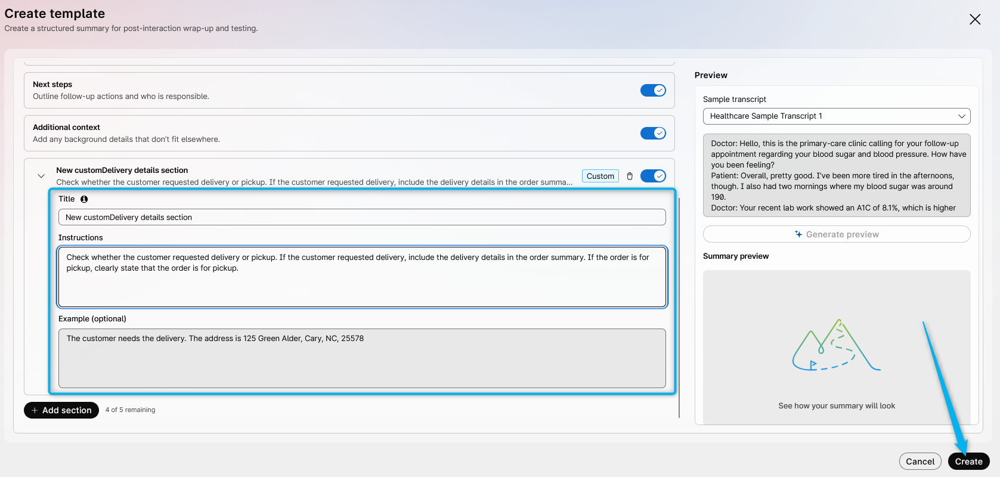

8. To test the results, in the **Preview** section select **Sample transcript** as **Custom**.
   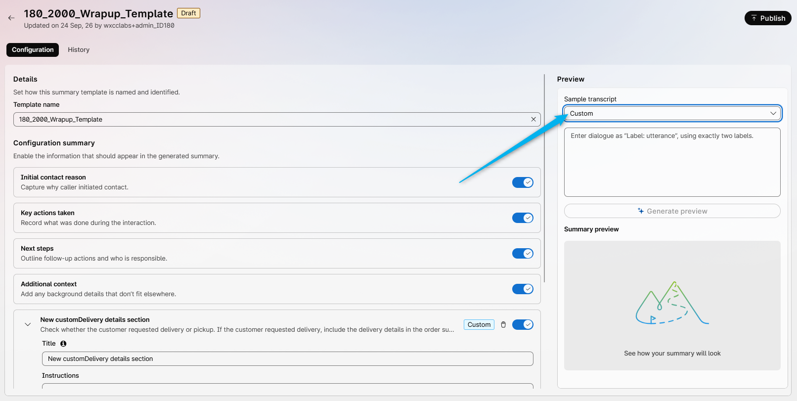

9. Enter the sample of the conversation below and click on **Generate preview**. You will see the results including your custom section.

    Conversation sample: **<copy>Agent: Hello, thank you for calling. How can I assist you with your order today?
Caller: I would like to order 20 red roses for pickup. I don’t need delivery. Please send the SMS confirmation to 9327579850.
Agent: Certainly. I have an order for 20 red roses, with pickup and no delivery. The SMS confirmation will be sent to 9327579850.
Caller: Yes, that’s correct.
Agent: Your order has been created successfully and will be ready for pickup. Thank you for your business.</copy>**
   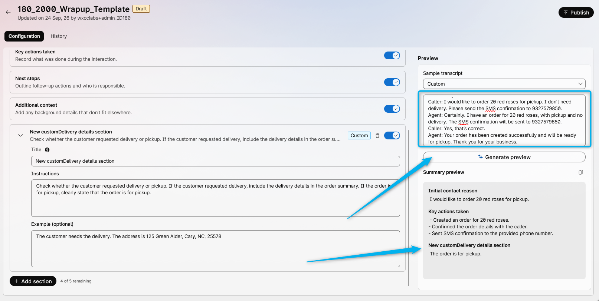

10. Click on **Publish**, leave a comment, and click on **Publish** again. 
   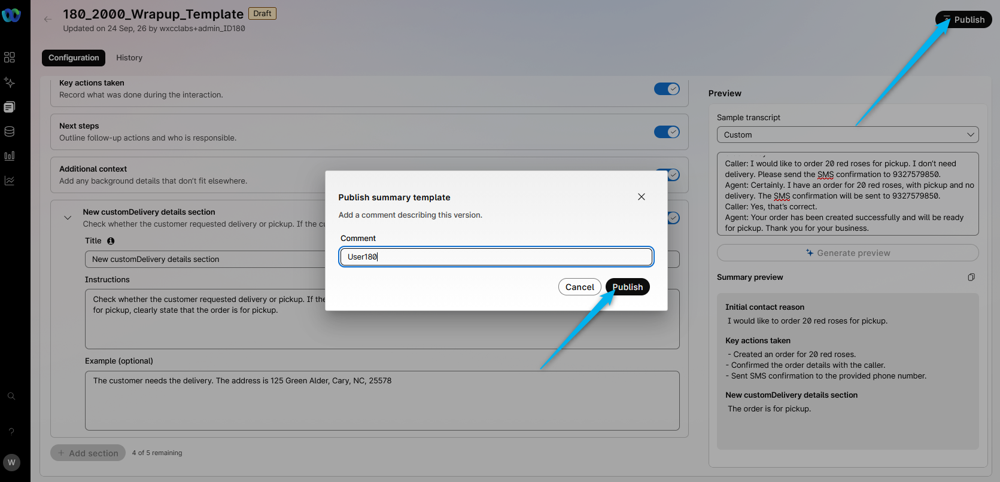

### Task 2. Assign the custom template to the queue

1. In **Collaboration Control Hub**, go to **Contact Center**, scroll down until you see the **AI Features** module. Open it and select the **Queue** tab.
   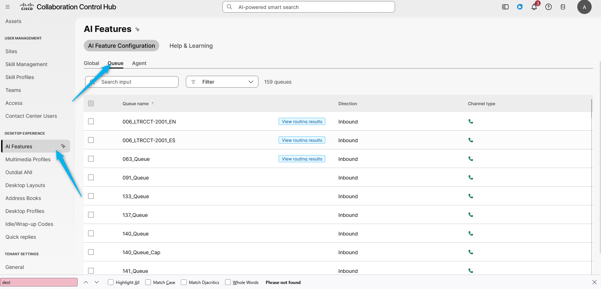

2. Search for your queue **<copy><w class="attendee"></w>\_2000_Voice_Queue</copy>** and open it.
   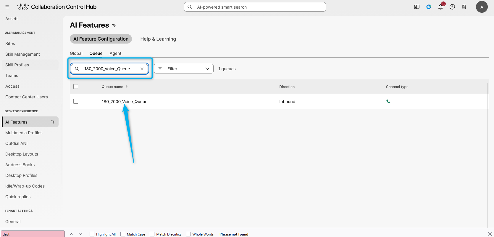

3. Scroll to **Generated Summaries** / **Wrap-up Summary**. Enable the Generated Summaries toggle. Select your custom template **<copy><w class="attendee"></w>\_2000_Wrapup_Template</copy>** to assign it to this queue. Then click **Save**.
   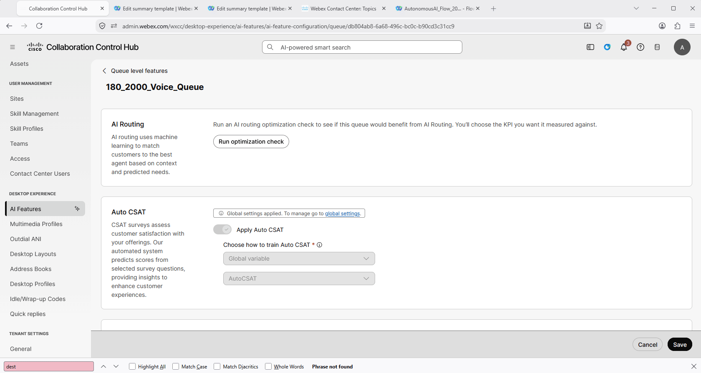

4. Place a test call and connect to a human agent. Simulate the conversation that you are ordering flowers and specify if you need delivery. Review the Wrap-up summary after the call is completed.
   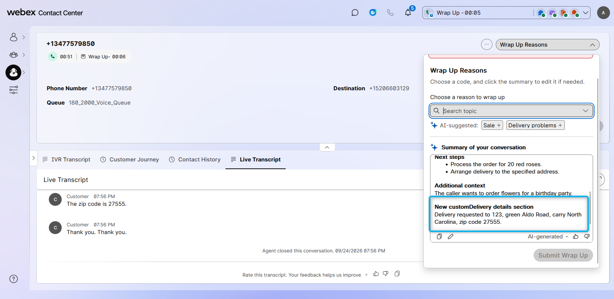

<strong>Congratulations, you have officially completed this mission! 🎉🎉 </strong>

