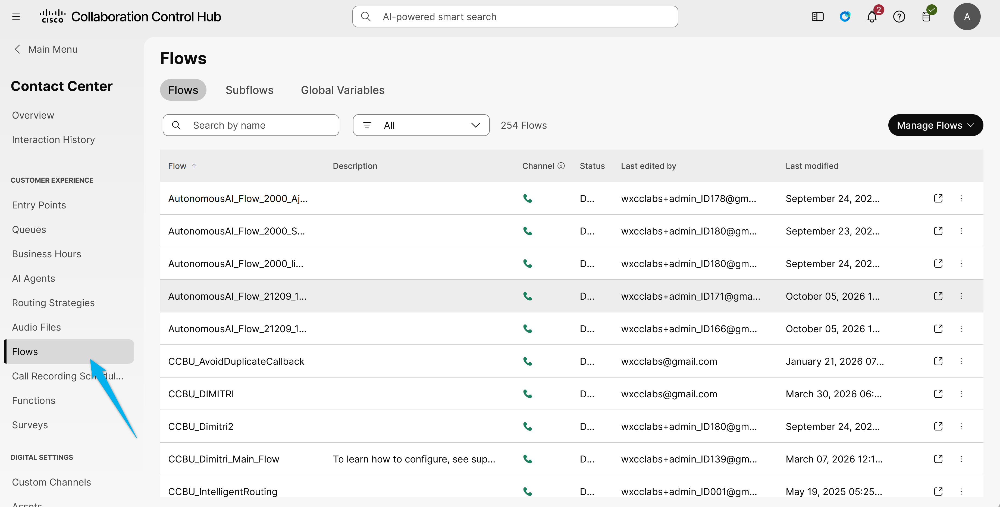
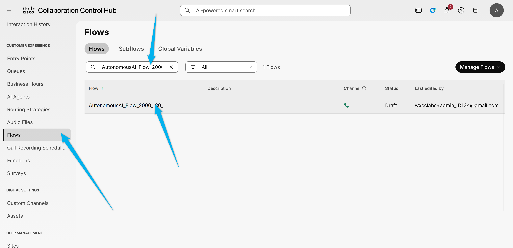
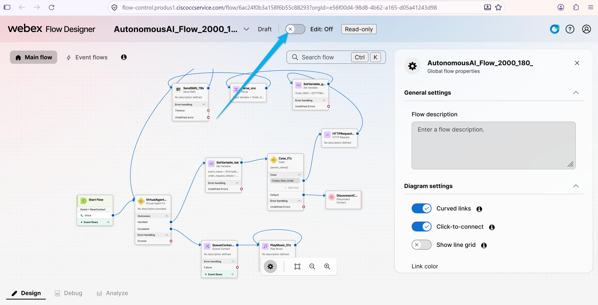
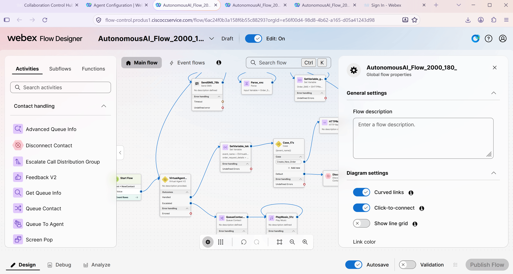
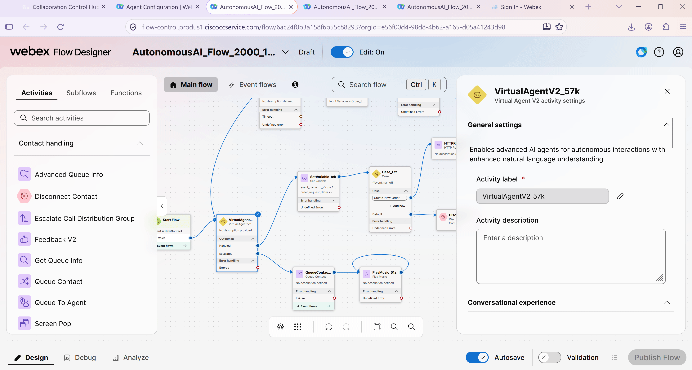
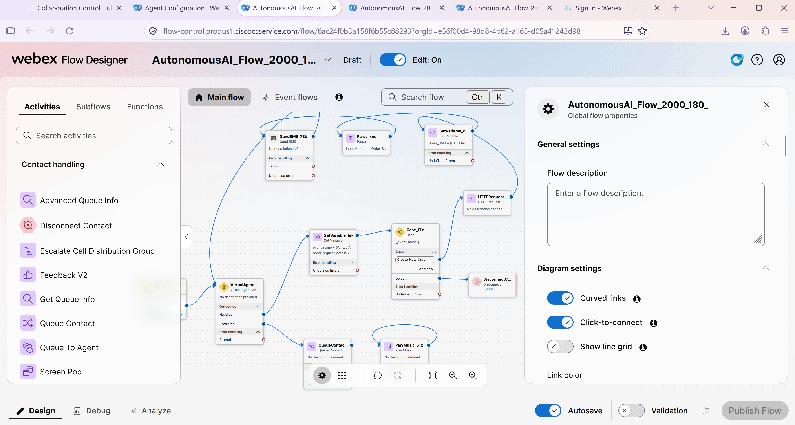
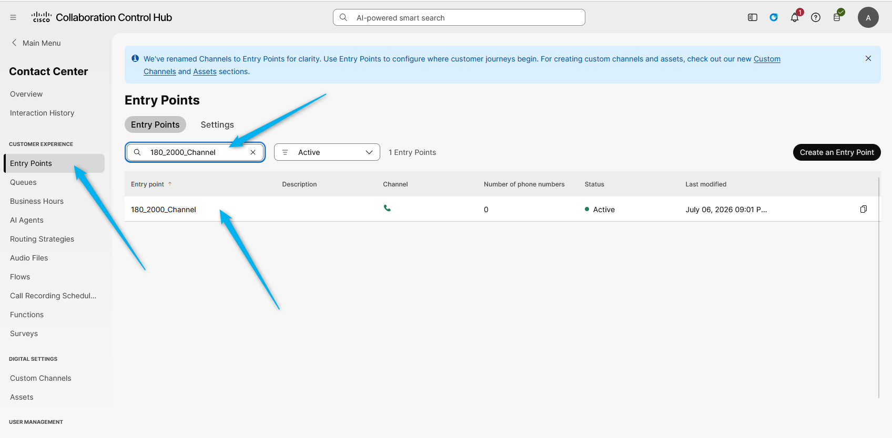
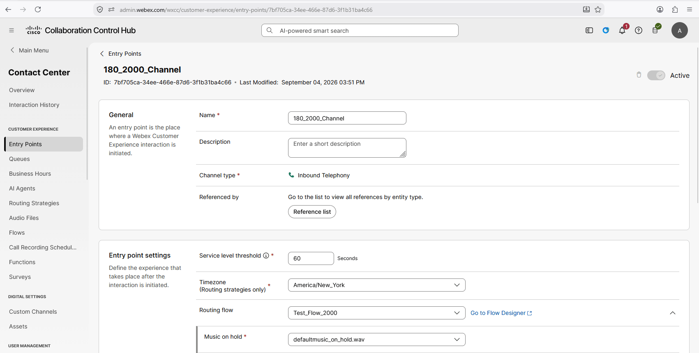
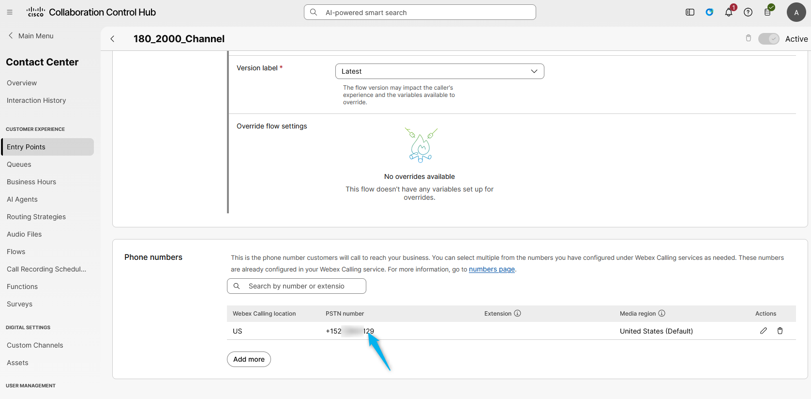

# Mission 2: Integrating the AI Agent with Flow for Voice Calls

## Mission overview

Your mission is to:

Integrate the AI Agent with the Voice Flow.

### Task 1. Build WxCC voice flow with AI Agent.

1. In [Collaboration Control Hub](https://admin.webex.com){:target="_blank"}, go to **Contact Center** and navigate to **Flows**. We have prebuilt some portion of the flow for this lab. You will need to find the prebuilt flow for your ID by following the steps below.
   
2. On the next page, search for the flow that is related to your ID **<copy>AutonomousAI_Flow_2000_<w class="attendee"></w></copy>**. Open the flow by clicking on it.
   

3. Click on **Edit** to start editing the flow.
   

4. Click on **VirtualAgentV2** node and change the Virtual Agent name to the one that is related to your ID - **<copy><w class="attendee"></w>\_2000_AutoAI_Lab</copy>**.
   

5. Click on **Queue Contact** node and change the queue name to **<copy><w class="attendee"></w>\_2000_Voice_Queue</copy>**.
   

6. Validate and publish the flow. 
   

7. Assign the Flow to your **Entry Point**. Do this by first going to **Entry Point** and search for your channel **<copy><w class="attendee"></w>\_2000_Channel</copy>**.
   

8. Click on **<copy><w class="attendee"></w>\_2000_Channel</copy>**. In the **Entry Point** settings section, change the following and then **Save** the changes. 
    Routing Flow: **<copy>AutonomousAI_Flow_2000_<w class="attendee"></w></copy>** 
    Version Label: **Latest** 
    

9. Dial the support number assigned to your **<w class="attendee"></w>\_2000_Channel** to test the Autonomous AI Agent over a voice call and make sure the agent can answer questions based on the knowledge base. At this stage, the agent will not be able to complete the order because fulfillment is not configured yet. In the next mission, you will configure fulfillment to send an API call to a third-party application to create the order.
   

<strong>Congratulations, you have officially completed this mission! 🎉🎉 </strong>

