# Mission 8: Bring Your Own LLM (<span class="optional-yellow"><strong>Optional</strong></span>)

**<details><summary>What is Bring Your Own LLM? <span style="color: orange;"></span></summary>**

Bring Your Own LLM (BYO LLM) allows an organization to bring their own LLM to the Webex AI Agent through a **Custom AI Engine**. A Custom AI Engine lets Webex AI Agent use your own LLM for reasoning and generation, while Webex continues to manage media, state, orchestration, and channel integration.

## </details>

## Feature Description

This optional mission uses **OpenRouter** as the API gateway to the AI models. The OpenRouter workspace is **preconfigured** for **GPT6-Luna** on the instructor's personal account, so that tenant cannot be shared. Task 1 is **read only** and shows exactly what was done to get the API details for the Webex integration.

Complete the earlier Autonomous AI Agent missions first, then work through these tasks in order:

1. **Task 1:** Review the preconfigured **OpenRouter** API gateway for **GPT6-Luna**. <span style="color: red;">[Read Only]</span>
2. **Task 2:** Register the LLM as an agentic app in the **Webex Developer Portal**.
3. **Task 3:** Configure authentication in **Collaboration Control Hub**.
4. **Task 4:** Create the AI Engine in **AI Agent Studio** and assign it to your flower shop AI Agent.

---

## Build

### (<span style="color: red;"><strong>Read Only</strong></span>) Task 1. Review OpenRouter API Gateway

**<details><summary>What is OpenRouter? <span style="color: orange;"></span></summary>**

OpenRouter is a unified API gateway and marketplace that lets you access over 500 different artificial intelligence models—including from providers like OpenAI, Anthropic, and Google—using a single API key and billing account. It provides a single OpenAI-compatible endpoint to many AI models, including GPT models. In this lab, OpenRouter sits between Webex AI Agent and **GPT6-Luna** so the Custom AI Engine can call the LLM without each attendee managing a model-provider account.

## </details>

<span style="color: red;">**[Read Only]**</span> This task is for review only.

This lab uses **OpenRouter** as the API gateway to the AI models. The gateway is already preconfigured for **GPT6-Luna**.

For this lab, the instructor uses a **personal OpenRouter account** with **personal billing details**, so access to this specific OpenRouter tenant cannot be shared. In this task, you will see exactly what was done to get the API details for the Webex integration. After the lab, you can easily create your **own OpenRouter account** and API key for the same integration.

1. Open [OpenRouter](https://openrouter.ai/){:target="_blank"}. Log in, or create an account to log in.

2. You will be prompted to add billing details. Add your billing card and buy some credits.
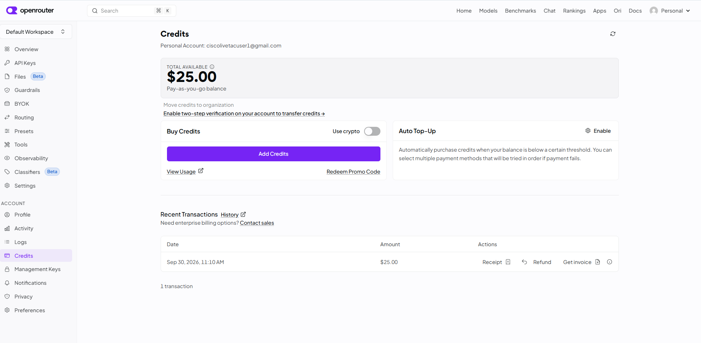

3. Click **API Key** and create a new **API key**.
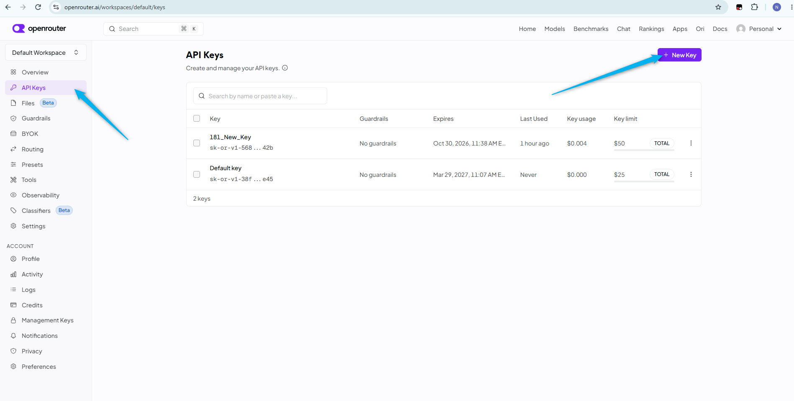

4. Fill in the required fields and click **Create**.
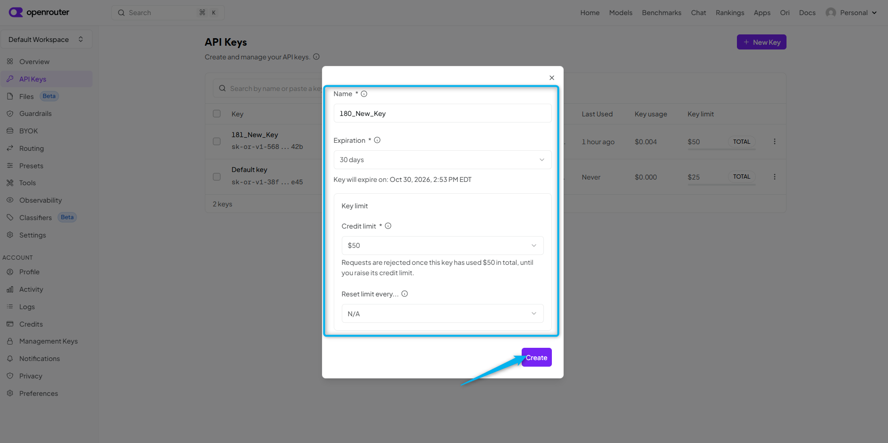

5. Copy the API key. You will need it for authentication with Webex.


6. Click **Models**. Search for the model that you want to use with your Webex AI Agent. For this lab we will be using **GPT6-Luna**, because this model is fast, capable, and inexpensive. For your own use cases, you can select faster models that will give you a better customer experience.


7. If you select the model and click **API > cURL**, you will see the base URL for the OpenRouter completions service. You will use this URL in the next task while creating the agentic app in the Webex Developer Portal.


8. In addition to the base URL for the completions service, you also need the URL suffix that is specific to this model. You can find it on the same page, right after the model name. See the screenshot. You will use this URL extension in Task 4 when you create the Custom AI Engine.


### Task 2. Register the LLM as an Agentic App

**<details><summary>What is an Agentic App? <span style="color: orange;"></span></summary>**

An Agentic App registers an external capability — in this case your own LLM — in the Webex ecosystem so administrators can approve it, configure authentication, and use it with Webex AI Agent.

## </details>

Your task is to **register your LLM as an agentic app** in the **Webex Developer Portal**. This agentic app represents the preconfigured **OpenRouter GPT6-Luna** gateway from Task 1.

1. Open the [Webex Developer Portal](https://developer.webex.com/){:target="_blank"}.

2. Click **Login**. Sign in with your admin credentials.
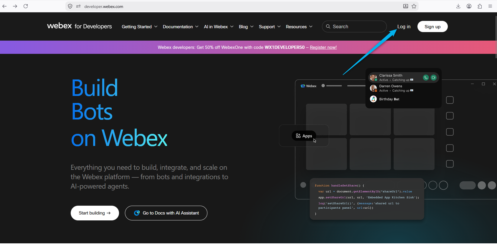

3. Under the profile menu, click **My Webex Apps**.


4. Click **Create a New App**.


5. On the next page, select **Create an Agentic App**.


6. Under **Agentic App Module**, select **LLM Engine**.


7. Enter the OpenRouter base URL that you found in Task 1: **<copy>https://openrouter.ai/api/v1/chat/completions</copy>**


8. For the LLM Service, select **Chat Completion V1**.


9. Name your app **<copy><w class="attendee"></w>\_2000_CustomLLM</copy>**.
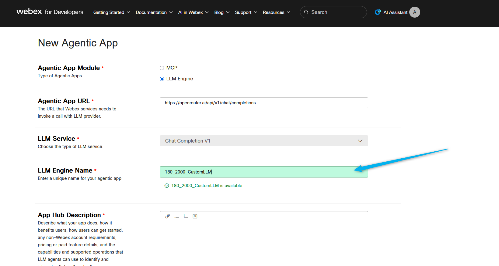

10. For **Agent App Description**, paste the text below (use the **copy** icon on the code block):

    ``` text
    Custom LLM for the flower shop AI Agent. This agentic app exposes an external Large Language Model that will be used as a Custom AI Engine for the Autonomous AI Agent.
    ```

11. Select an available Agentic App icon.
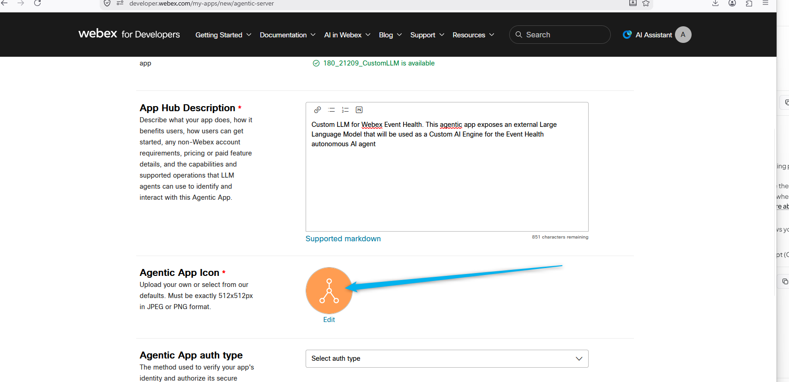

12. For **Agentic App auth type**, select **API key**, then click **Add Agentic App**.


### Task 3. Configure Authentication in Collaboration Control Hub

Your task is to **configure authentication for the agentic app** in **Collaboration Control Hub**.

1. Go to [Collaboration Control Hub](https://admin.webex.com){:target="_blank"}. If you are in Contact Center settings, click **Main Menu** at the top to go to general settings.

2. Open **Apps**, then click **Agentic Apps**.


3. Find the app associated with your ID, **<copy><w class="attendee"></w>\_2000_CustomLLM</copy>**, and open it.
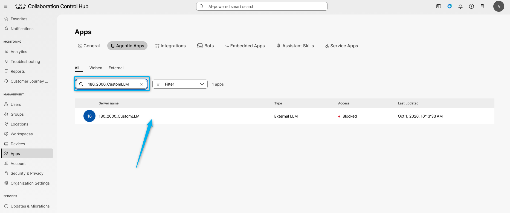

4. Make it **Allowed for all users**, enable **Authorize automatic server data updates**, and click **Save**.
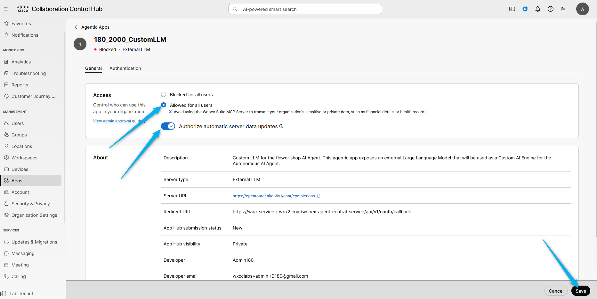

5. Open the **Authentication** tab. Select **API key** as the authentication method and enter the API key from OpenRouter as shown in Task 1. Click **Save**.
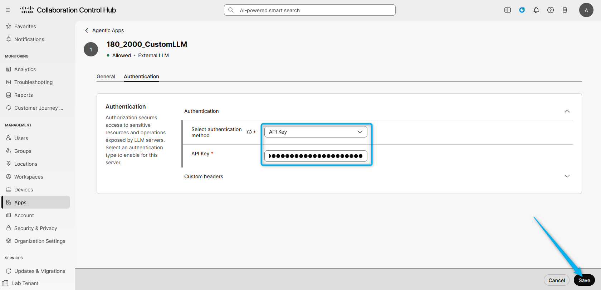

### Task 4. Create and Assign the Custom AI Engine

**<details><summary>What is a Custom AI Engine? <span style="color: orange;"></span></summary>**

A Custom AI Engine lets Webex AI Agent use your own LLM for reasoning and generation, while Webex continues to manage media, state, orchestration, and channel integration.

## </details>

Your task is to **create the AI Engine in AI Agent Studio**, point it at the agentic app you registered in Task 2, and **assign it** to your flower shop AI Agent. The engine uses the preconfigured **OpenRouter** gateway to reach **GPT6-Luna**.

1. Go to [Collaboration Control Hub](https://admin.webex.com){:target="_blank"}.

2. Open **Contact Center** from the left navigation, and under **Overview > Quick Links**, click **Webex AI Agent**.

3. In **AI Agent Studio**, open **AI Engines**.


4. Click **Create AI Engine**.


5. Provide the following information, then click **Next**.

    > Engine Name: **<copy><w class="attendee"></w>\_2000_CustomAIEngine</copy>**
    >
    > Description: **<copy>Custom Engine</copy>**
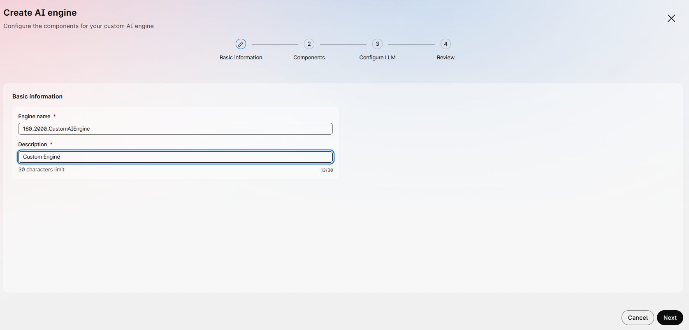

6. Don't make any changes on the next page. Just click **Next**.
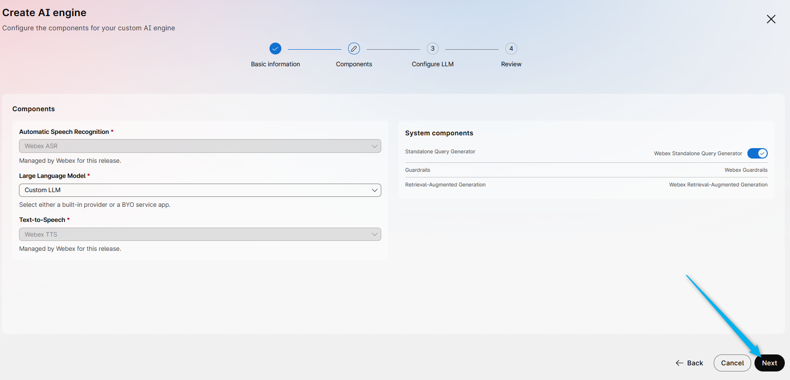

7. Select your custom LLM that is related to your ID from the list.
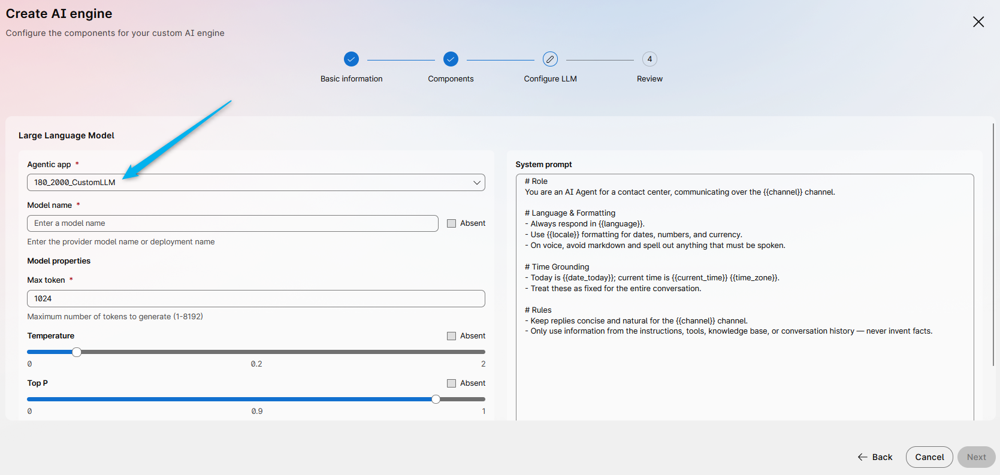

8. In **Model name**, provide the exact LLM name that you saw in OpenRouter. Please review Task 1, step 8. In this lab it is **<copy>openai/gpt-6-luna</copy>**.
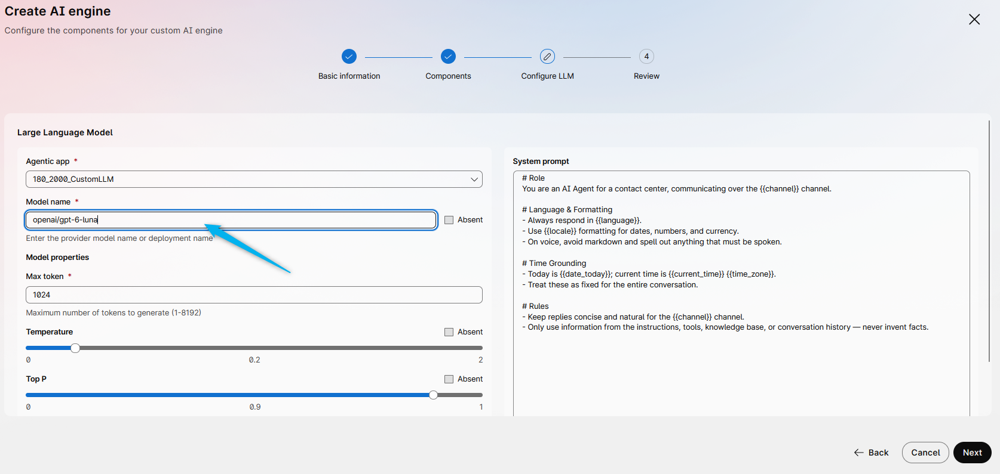

9. Select **Absent** for **Temperature** and **Top P**, because not all third-party models support these features.
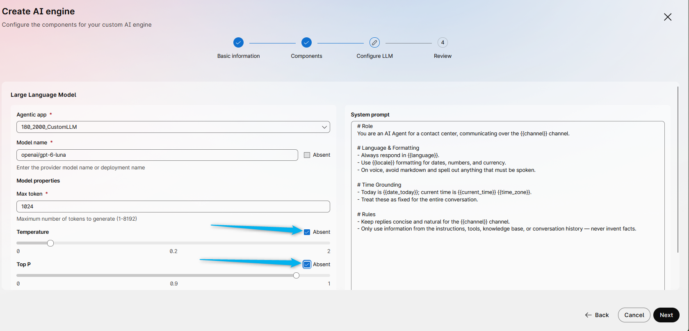

10. Review the prompts for the model. This prompt will be appended to the instructions of your AI agent. You don't need to customize it in this lab, but for your business you can customize it for your needs. Then click **Next**.
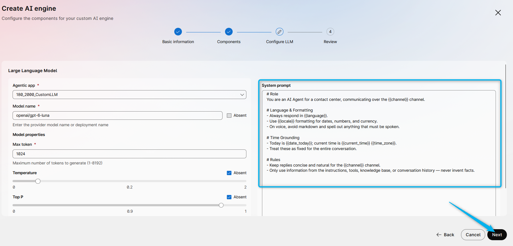

11. On the next page, click **Validate**.
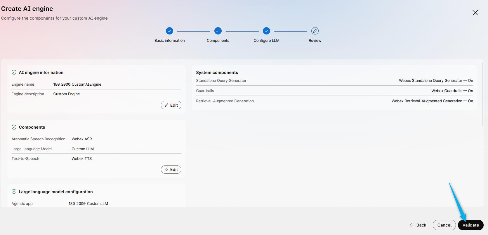

12. After validation is completed, click **Create engine**.
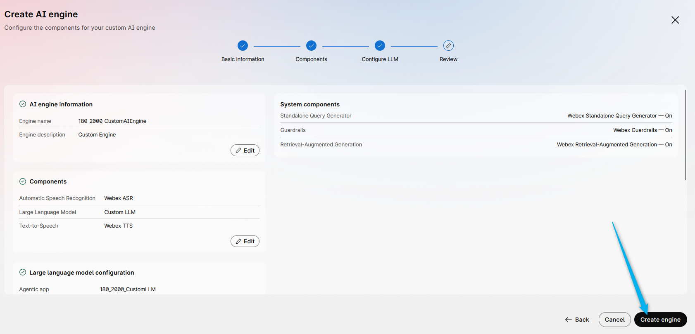

13. In **AI Agent Studio**, open **AI Agents**.
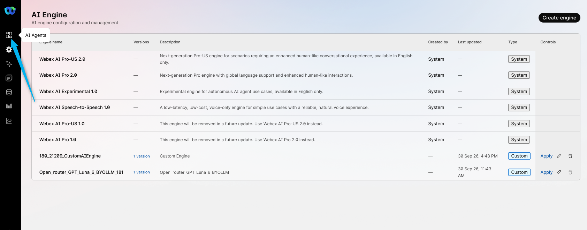

14. Select the agent **<copy><w class="attendee"></w>\_2000_AutoAI_Lab</copy>**.
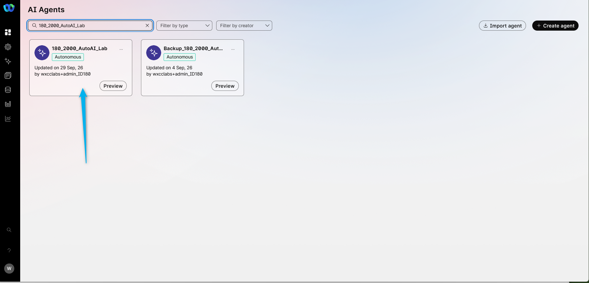

15. In the agent profile, change **AI engine** from **Webex AI Pro-US 2.0** to **<copy><w class="attendee"></w>\_2000_CustomAIEngine</copy>**.
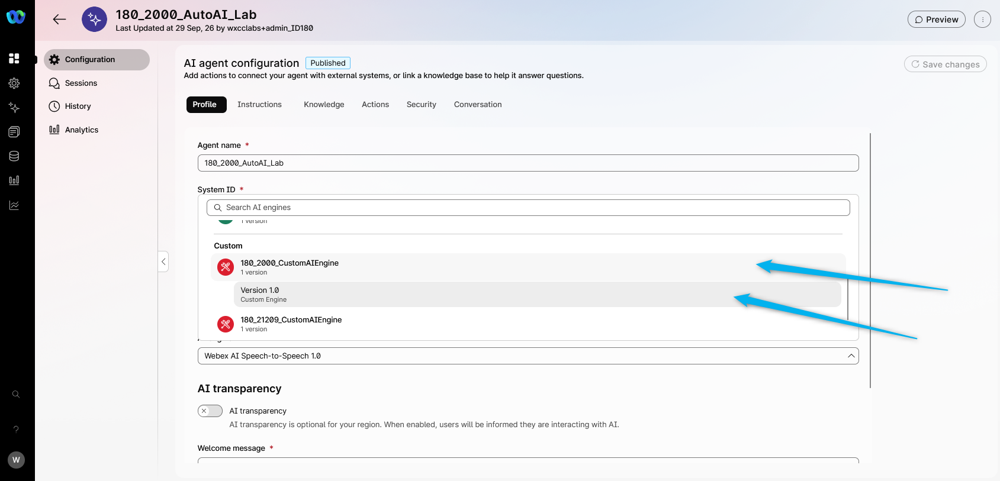

16. Click **Save changes**.
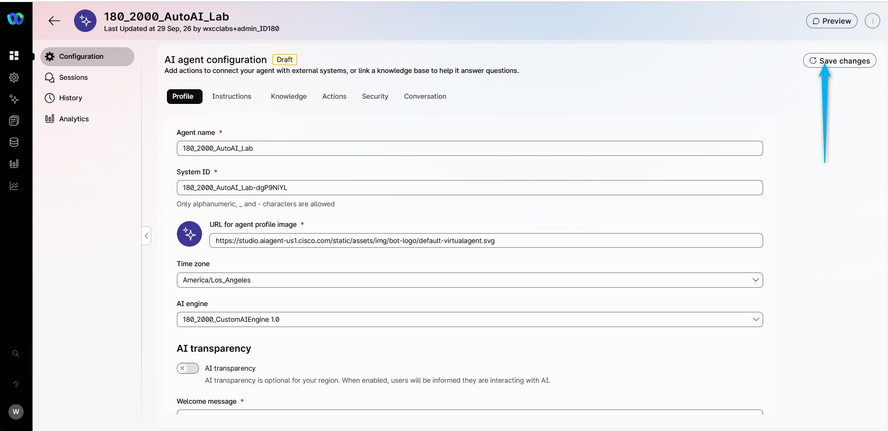

17. **Publish** the AI agent. Provide a version name (for example, **V2-BYOLLM**).
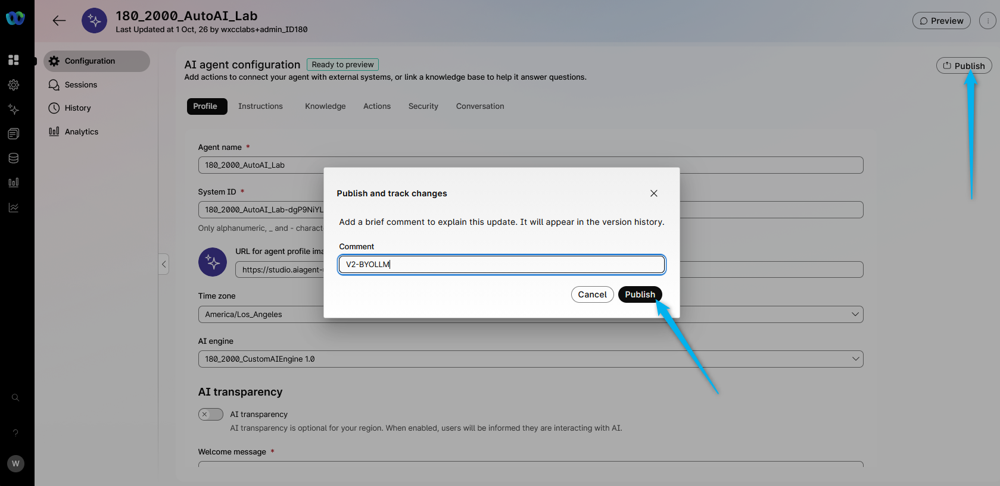

18. Click **Preview** and start a chat.

19. Send **<copy>I need flowers for my friend</copy>**. Confirm that the agent still answers using your flower shop knowledge and that responses are now driven by your Custom AI Engine.
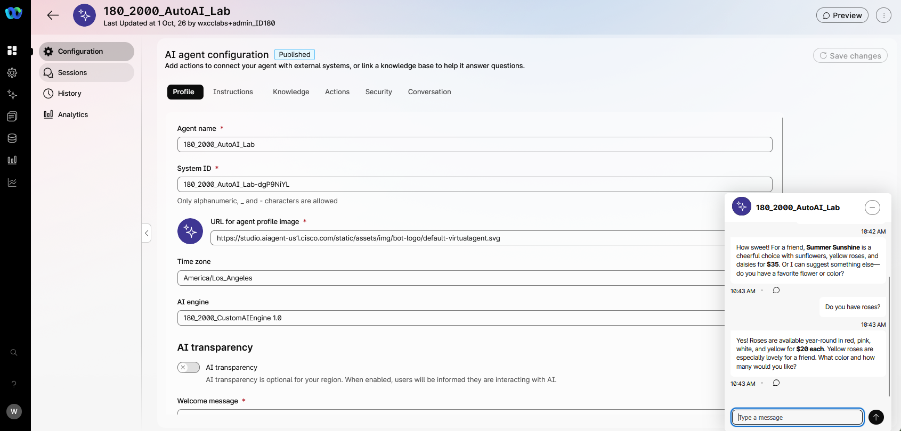

20. Call the phone number that is related to your Entry Point. Talk to the AI agent and try to order flowers with delivery. It uses the same AI Agent configuration, but a different LLM for chat completion on the backend.

### What you completed

- Reviewed the preconfigured **OpenRouter** API gateway that fronts **GPT6-Luna**. <span style="color: red;">[Read Only]</span>
- Registered the LLM as an **agentic app** in the Webex Developer Portal.
- Configured **authentication** in Collaboration Control Hub.
- Created the **Custom AI Engine** in AI Agent Studio, assigned it to your flower shop AI Agent, and tested the experience.

Webex continues to manage media, state, and orchestration. **OpenRouter** is the API gateway to **GPT6-Luna**, and your organization controls which LLM drives agent responses.

<p style="text-align:center"><strong>Congratulations, you have officially completed this mission! 🎉🎉 </strong></p>
