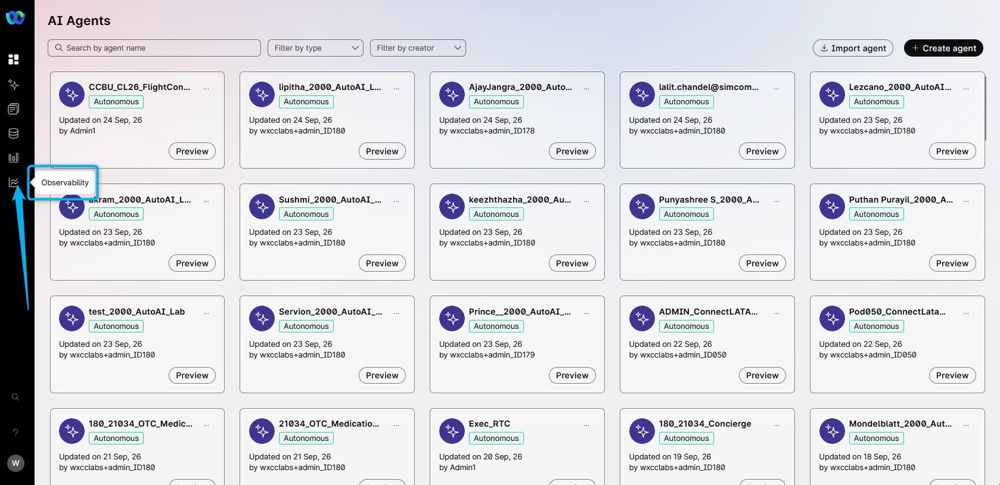
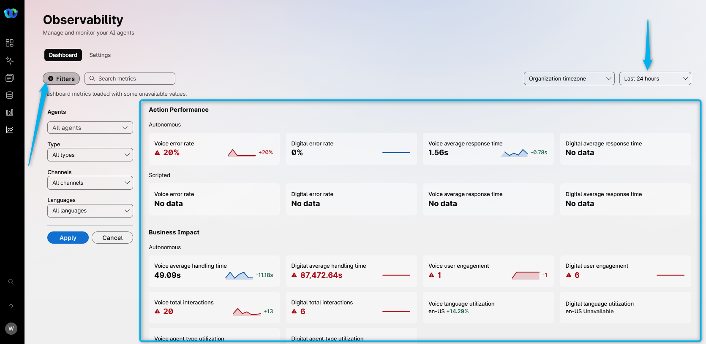
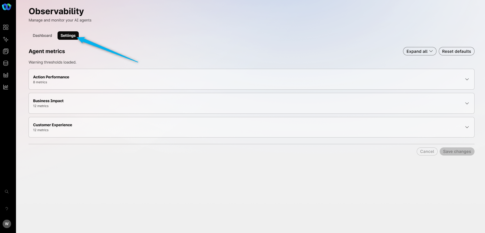

# Mission 7: Observability

**

What is Observability? 
**

Observability is the customer-facing view in Webex AI Agent Studio for monitoring AI Agent behavior. Use the page, controls, values, warnings, charts, and actions that are visible in the UI. First-line review starts with this dashboard. Do not assume access to backend service logs or analyzer logs.

## 

## Feature Description

When you need to understand how an AI Agent is performing, start with **Observability** in AI Agent Studio.

You can:

- Open **AI Agent Studio**.
- Open **Observability** from the primary navigation.
- Use the available **Dashboard** and **Settings** tabs.

If a tab or control is not available, record the visible access state. Do not assume that you have the required role, permission, entitlement, or feature enablement.

## Mission overview

Your mission is to:

Go to Webex AI Agent Studio, open the Observability module, and review the dashboard.

---

## Build

### Task 1. Review the Observability dashboard

1. In [Collaboration Control Hub](https://admin.webex.com){:target="_blank"} under **Contact Center**, go to **Overview** and open **Webex AI Agent**.

2. From the primary navigation, open **Observability**.
   
3. Review the currently available **Filters** and the **Dashboard**.
   
4. Open the **Settings**. This is where you can control your Observability parameters. 
   

<strong>Congratulations, you have officially completed this mission! 🎉🎉 </strong>

