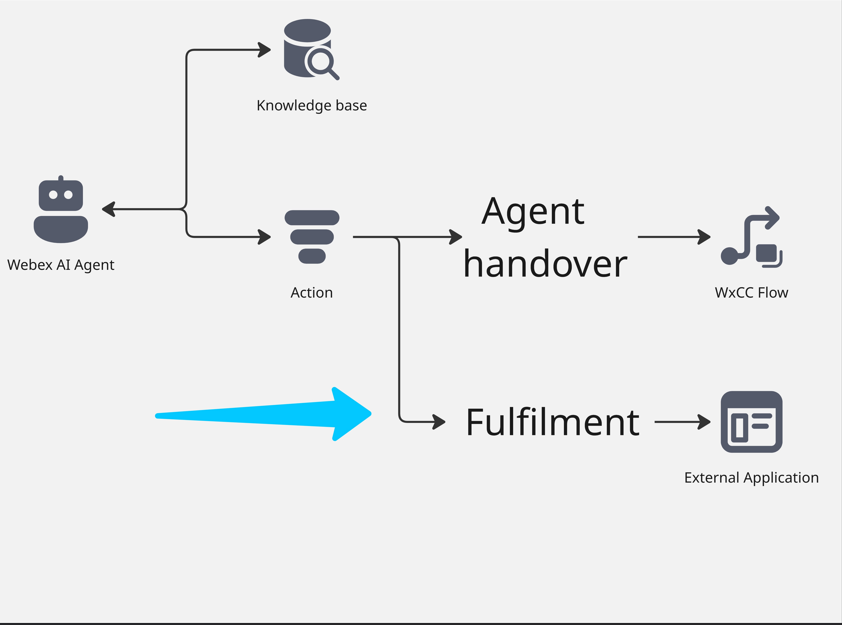
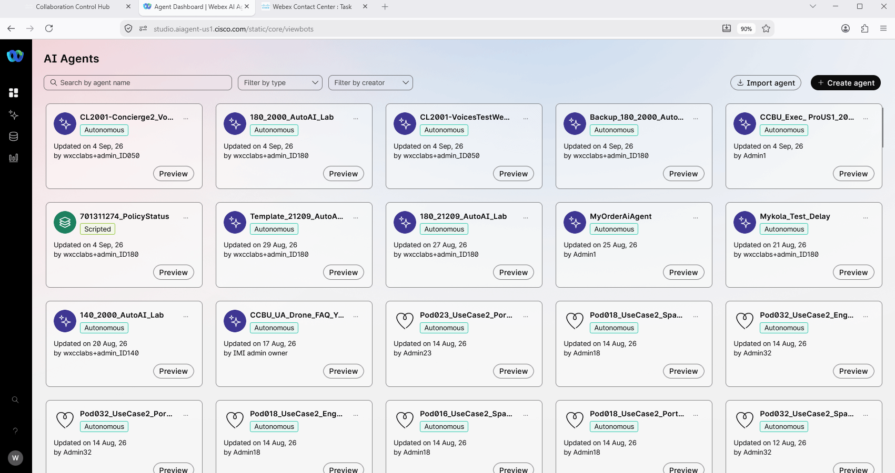
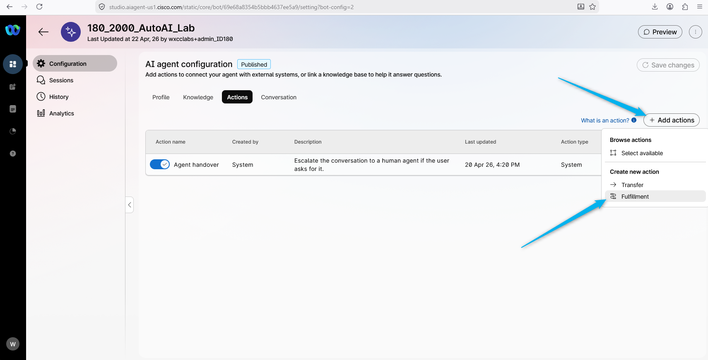
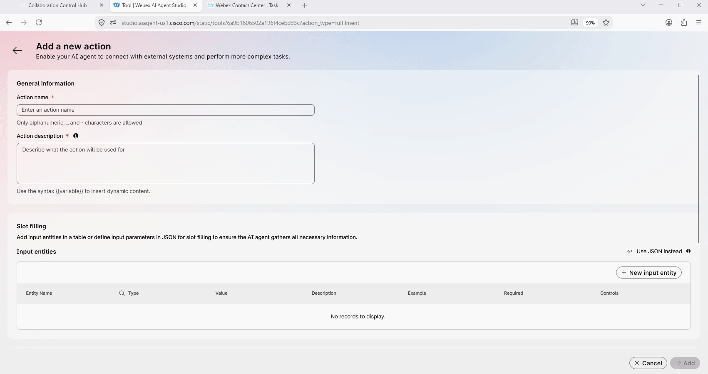
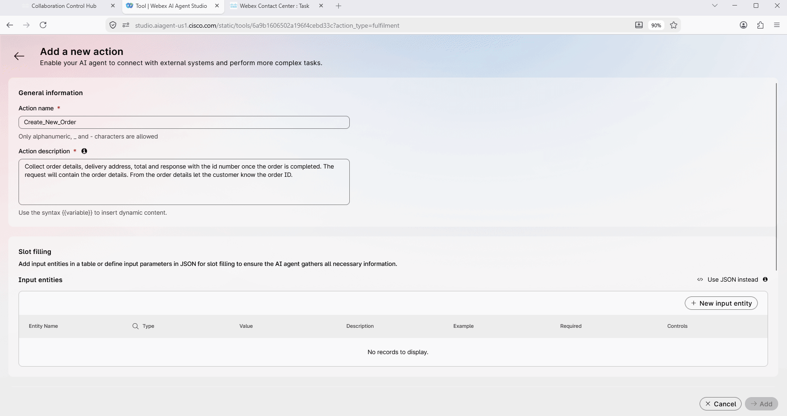
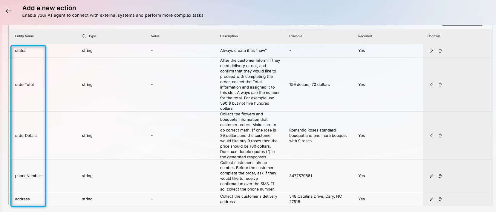
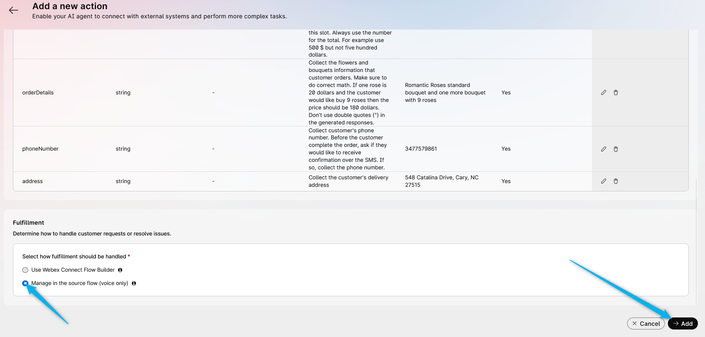
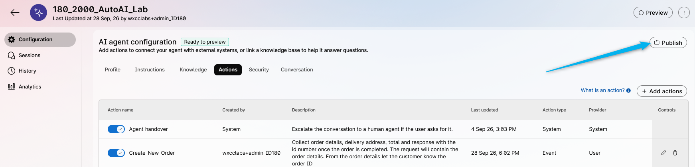
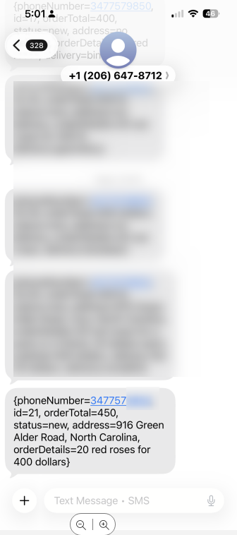
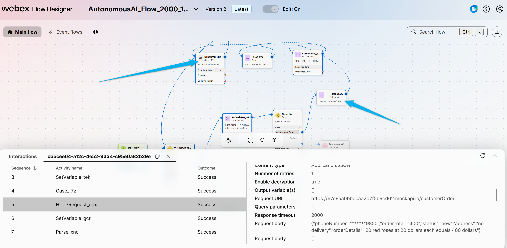

# Mission 3: Configure Fulfillment Action and create an order using **Voice Flow**.

**

What is Fulfillment Action? 
**

Fulfillment Action is a task that an AI agent performs by understanding user intents and completes by connecting to external systems over an API.

## 

## Mission overview

In this mission, you will use the Voice flow to execute the API call that creates the order and completes the AI Agent Fulfillment.

---

## Build

### Task 1. Configure Action in the AI Studio

1. Go to **Webex AI Agent** Studio Portal.

2. Select your AI agent with name **<copy><w class="attendee"></w>\_2000_AutoAI_Lab</copy>** that you created earlier and go to **Actions**. You will see one Action is already created by default for the Agent Handoff. We will now create a few more actions.
   

3. Click to create <b>New Action</b>. From the drop-down option, select **Fulfillment**.
   

4. Configure it with name **_<copy>Create_New_Order</copy>_** and the Action description **_<copy>Collect order details, delivery address, total and respond with the ID number once the order is completed. The request will contain the order details. From the order details let the customer know the order ID.</copy>_**.
   

5. Scroll down and click to create **New input entity**. Fill up the table with the following and then click on **Add**.  
   > Entity Name: **_<copy>address</copy>_**  
   > Entity Type: <b>string</b>  
   > Description: **_<copy>Collect the customer's delivery address</copy>_** 
   > Example: **_<copy>548 Catalina Drive, Cary, NC 27515</copy>_**  
   > Required: <b>Yes</b>
   

6. By following the same pattern, create an entity to collect the customer's phone number. 
   > Entity Name: **_<copy>phoneNumber</copy>_** 
   > Entity Type: <b>string</b>  
   > Description: **_<copy>Collect customer's phone number. Before the customer completes the order, ask if they would like to receive confirmation over the SMS. If so, collect the phone number.</copy>_** 
   > Example: **_<copy>3477579861</copy>_** 
   > Required: <b>Yes</b>

7. By following the same pattern, create an entity to collect the customer's order details. 
   > Entity Name: **_<copy>orderDetails</copy>_** 
   > Entity Type: <b>string</b>  
   > Description: **_<copy>Collect the flowers and bouquets information that customer orders. Make sure to do correct math. If one rose is 20 dollars and the customer would like to buy 9 roses then the price should be 180 dollars. Don't use double quotes (") in the generated responses.</copy>_** 
   > Example: **_<copy>Romantic Roses standard bouquet and one more bouquet with 9 roses</copy>_** 
   > Required: <b>Yes</b>

8. By following the same pattern, create an entity to store the total price information of the order. 
   > Entity Name: **_<copy>orderTotal</copy>_** 
   > Entity Type: <b>string</b>  
   > Description: **_<copy>After the customer informs if they need delivery or not, and confirm that they would like to proceed with completing the order, collect the Total information and assign it to this slot. Always use the number for the total. For example use 500 $ but not five hundred dollars.</copy>_** 
   > Example: **_<copy>150 dollars, 70 dollars</copy>_** 
   > Required: <b>Yes</b>

9. By following the same pattern, create an entity to store the order status information. 
   > Entity Name: **_<copy>status</copy>_** 
   > Entity Type: <b>string</b>  
   > Description: **_<copy>Always create it as "new"</copy>_** 
   > Example: **_<copy>new</copy>_** 
   > Required: <b>Yes</b>

10. At this point you should see 5 created entities. Please double-check that your configuration matches the screenshot below.
    

11. Scroll down and for the **Fulfillment** option select **Manage in the source flow (voice only)**. Click **Save**.
   

12. **Publish** your AI Agent.
   

### Task 2. Test Fulfillment.

1. Place a test call, order flowers, and specify a number for SMS confirmation. Your order should be completed, and you should receive the SMS.

    

2. **[Read Only]** In the voice flow, the fulfillment branch was already preconfigured for this lab. You can review the configuration to understand it by tracing the call in the flow designer. In the flow designer, we use an **HTTP Request** node to send an HTTP request to a third-party application to create an order object. Then we send these results to the caller over SMS, and we send the order details back to the AI Agent in the **State Event**.

    

<strong>Congratulations, you have officially completed this mission! 🎉🎉 </strong>

