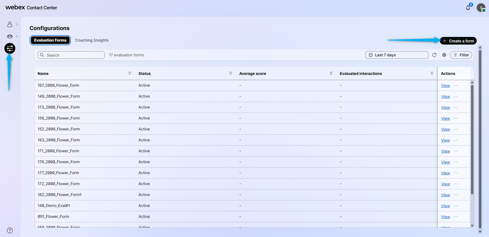
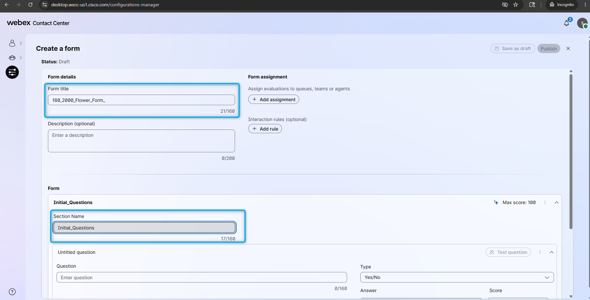
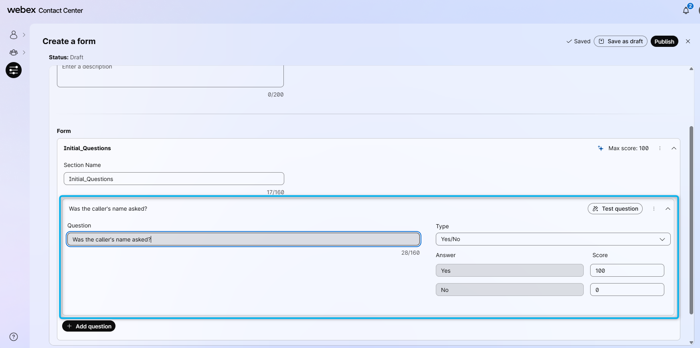
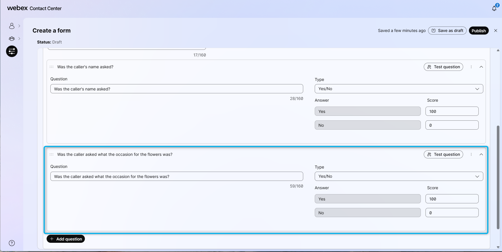
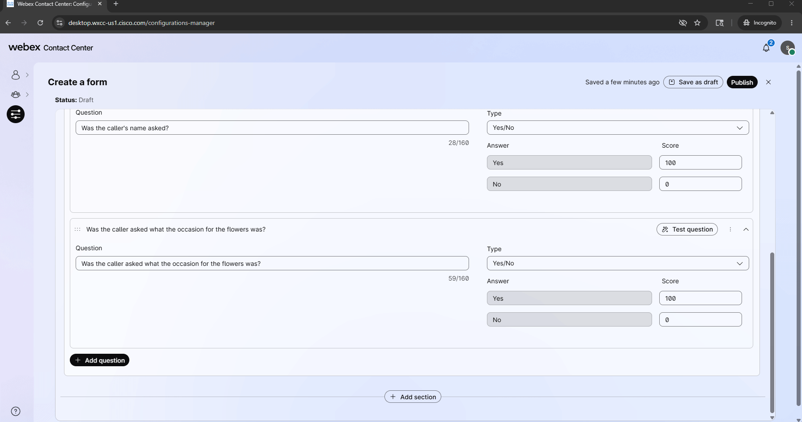
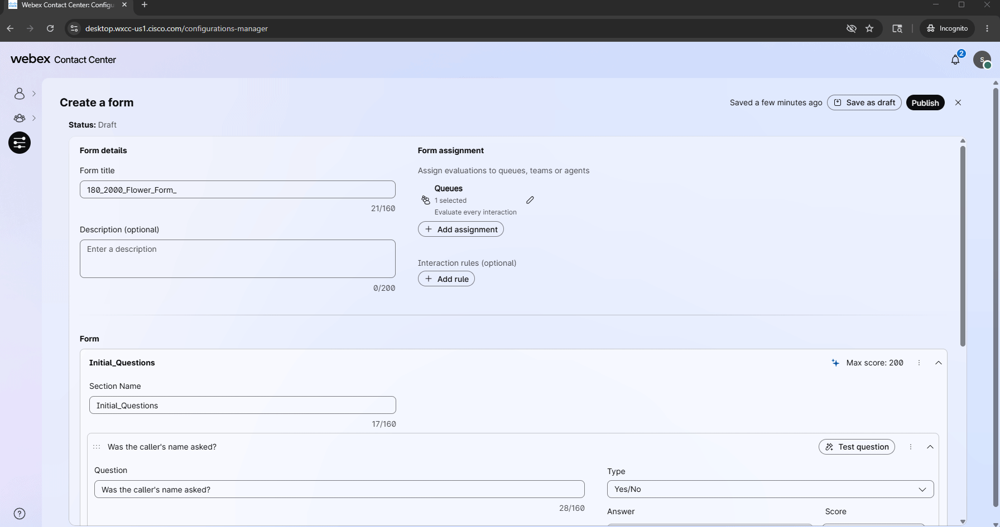
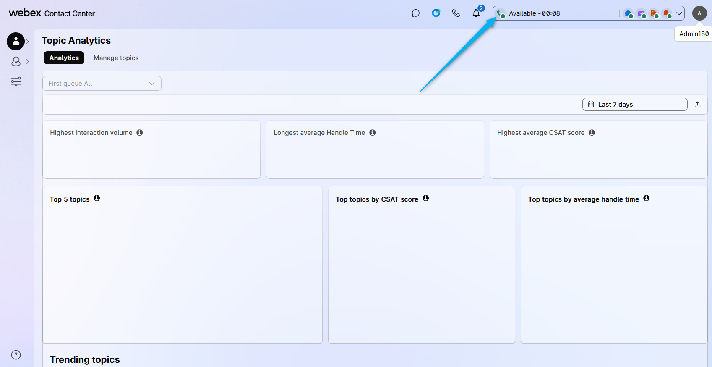
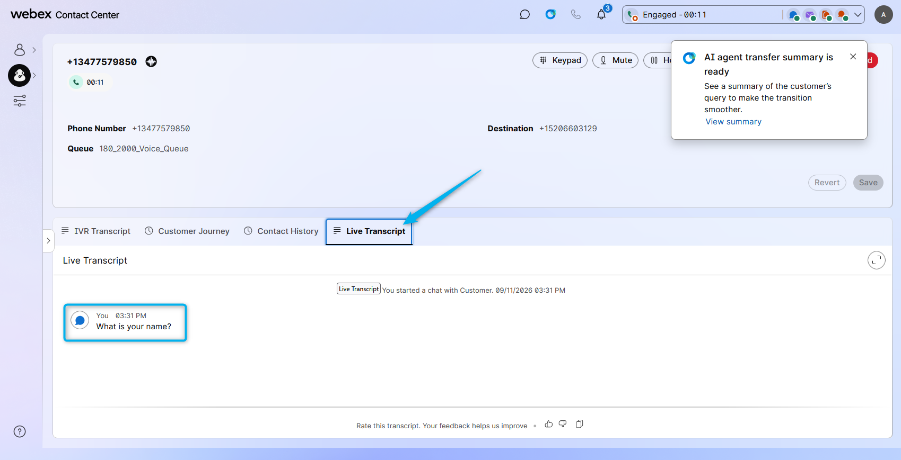
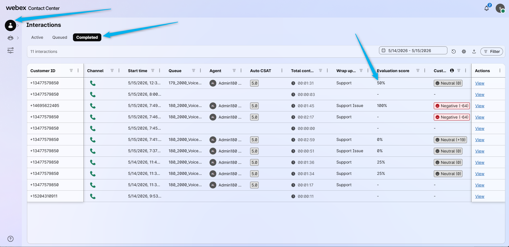

# Mission 1: Configure Evaluation of human agent's answers

## Mission overview

Your mission is to:

Create an Evaluation Form with requirements to ask the caller's name and the occasion for the flower purchase. Make test calls and, using the Supervisor Dashboard, evaluate if the human agent asked these questions to the caller.

---

## Build

### Task 1. Create Evaluation form

1. Click on **Configurations** and then select to **Create a form**.
   

2. In the Form title field enter **<copy><w class="attendee"></w>\_2000_Flower_Form_</copy>**. In the Section name field enter **<copy>Initial_Questions</copy>**
   

3. Configure the first question with the following: 
   > Question: **<copy>Was the caller's name asked?</copy>** 
   

4. **Add question** and configure the second question with the following: 
   > Question: **<copy>Have the agent asked what the occasion for the flowers was?</copy>** 
   

5. Scroll up and click on **Add assignment**. From the list of queues, select your queue **<copy><w class="attendee"></w>\_2000_Voice_Queue</copy>**. And click on **Assign**.
   

6. **Publish** the form.
   

### Task 2. Evaluate agent using the Evaluation form

1. Go back to your non-incognito browser and check if your agent is still logged in. You might still be logged in after completing the AI Assistant lab. If not, please login to your agent desktop using your **Admin** account.
   

2. Place a test call to the number that is associated with your channel **<copy><w class="attendee"></w>\_2000_Channel</copy>** and ask to talk to the human agent. During the conversation, ask the caller's name but don't ask what the occasion of the flowers is.
   

3. Go back to your Supervisor Desktop in the Incognito Window, click on **Interactions** and select **Completed**. Find you call you will see that Evaluation score is 50%. Because only one of two questions was asked by the agent. 
   

<strong>Congratulations, you have officially completed this mission! 🎉🎉 </strong>

