# Mission 1: Configure Evaluation of human agent's answers

## Mission overview

Your mission is to:

Create an Evaluation Form with requirements to ask the caller's name and the occasion for the flower purchase. Make test calls and, using the Supervisor Dashboard, evaluate if the human agent asked these questions to the caller.

---

## Build

### Task 1. Create Evaluation Form

1. Click on **Configurations** and then select **Create a form**.
   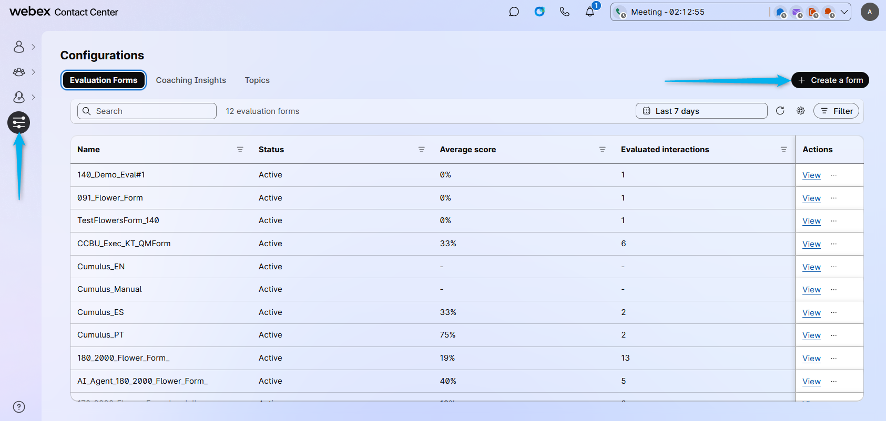

2. In the Form title field, enter **<copy><w class="attendee"></w>\_2000_Flower_Form_</copy>**. In the Section name field, enter **<copy>Initial_Questions</copy>**.
   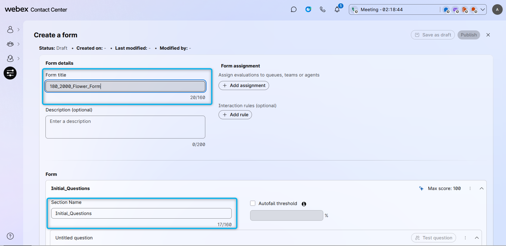

3. Configure the first question with the following: 
   > Question: **<copy>Was the caller's name asked?</copy>** 
   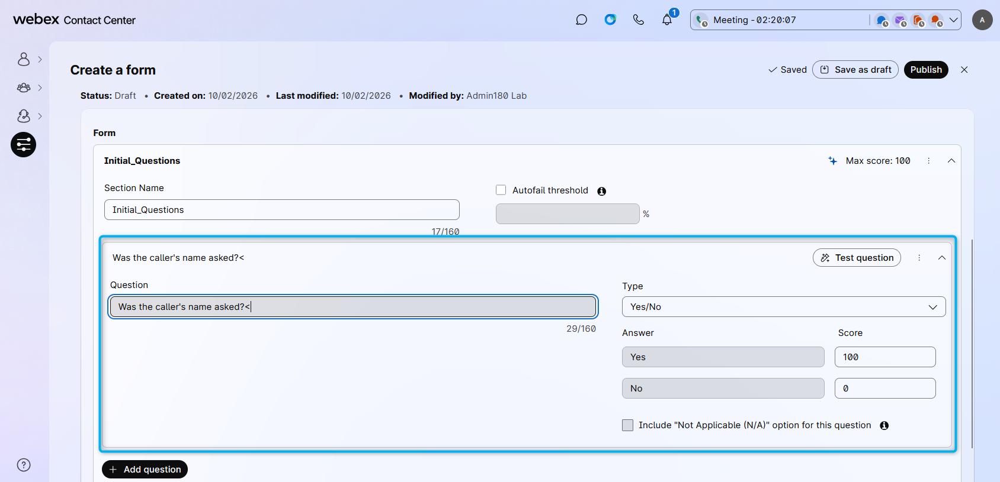

4. **Add question** and configure the second question with the following: 
   > Question: **<copy>Has the agent asked what the occasion for the flowers was?</copy>** 
   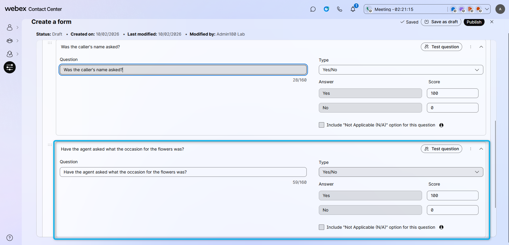

5. Scroll up and click on **Add assignment**. From the list of queues, select your queue **<copy><w class="attendee"></w>\_2000_Voice_Queue</copy>**. Then click on **Assign**.
   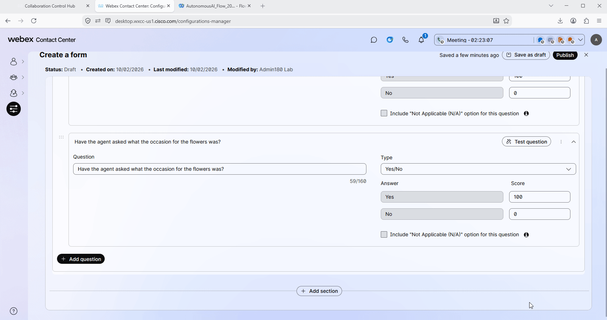

6. **Publish** the form.
   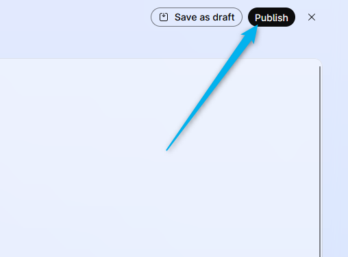

### Task 2. Evaluate the agent using the Evaluation Form

1. Make sure your Agent is in the Available status.
   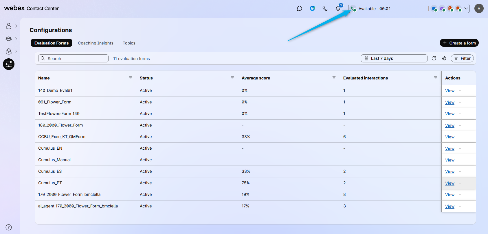

2. Place a test call to the number that is associated with your channel **<copy><w class="attendee"></w>\_2000_Channel</copy>** and ask to talk to the human agent. During the conversation, ask for the caller's name but don't ask what the occasion for the flowers is.
   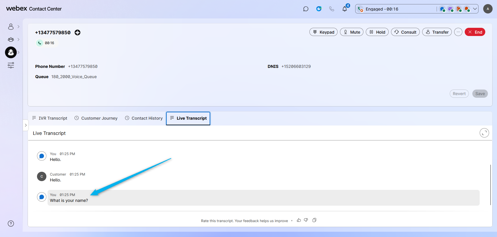

3. In the Monitor section, go to Interactions.
   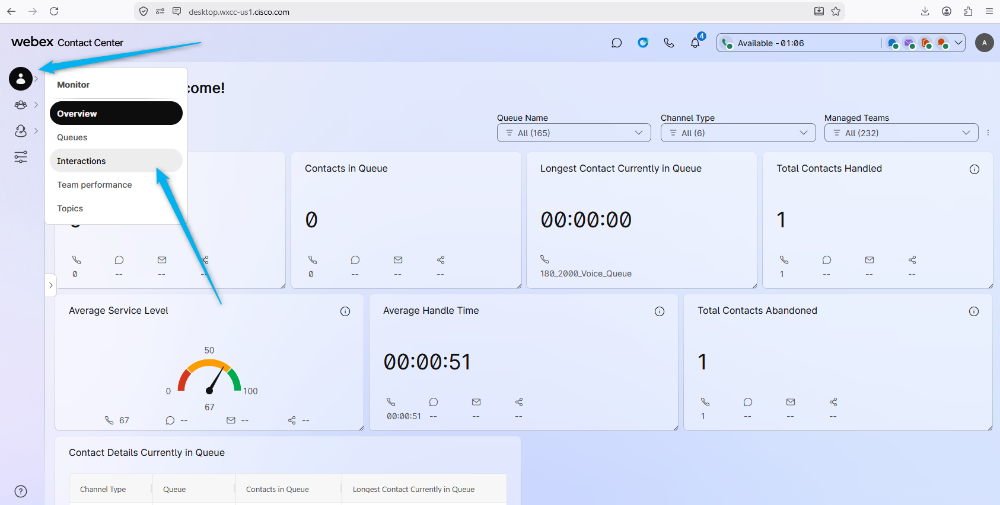

4. Click on **Completed** and review the Evaluation column that is related to your call. Depending on the overall system load, it could take a few minutes for the results to show up. So you might not see any score related to the call immediately. We already sent this feedback to the engineering team and they are working on improving the system so the results show immediately. 
   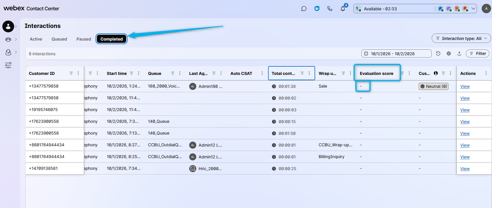

5. However, when all processes are completed, you will see the evaluation score under the Completed Interactions. Like in this example, the score is 50% because the agent asked only one of two questions from the Evaluation Form.
   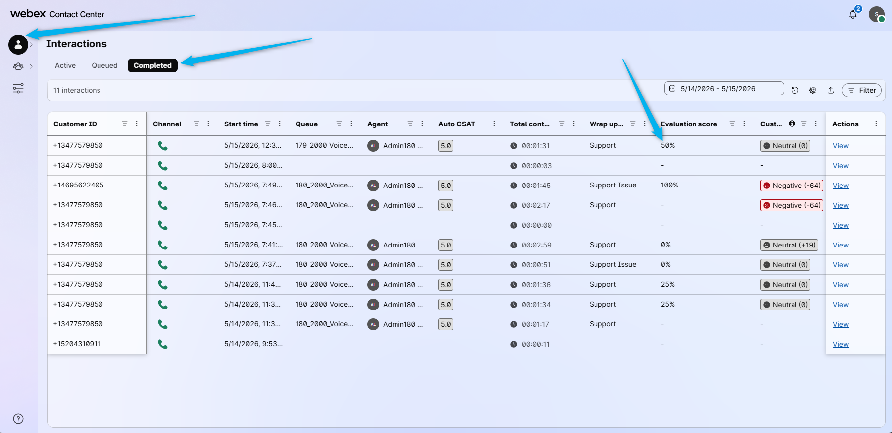

<strong>Congratulations, you have officially completed this mission! 🎉🎉 </strong>

