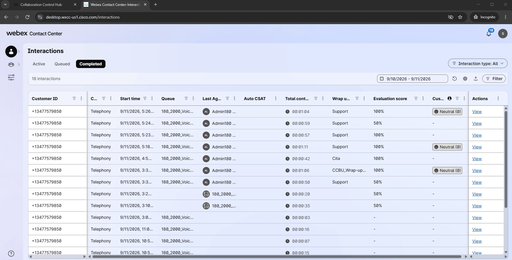
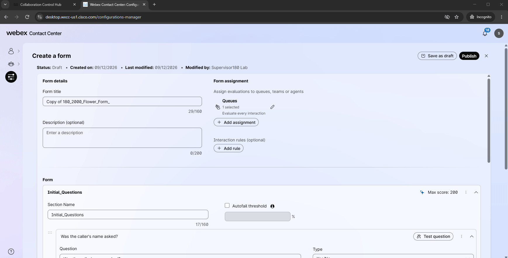
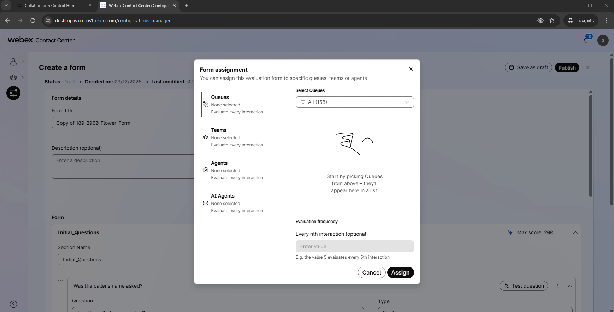
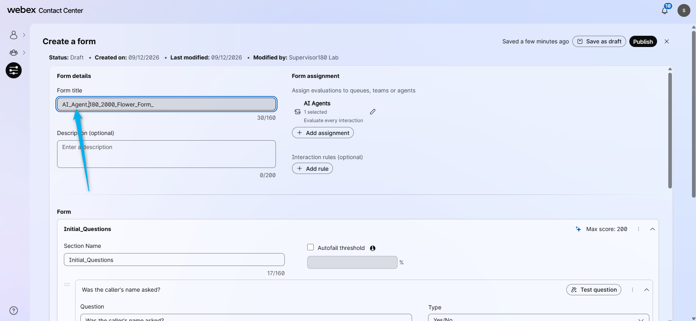
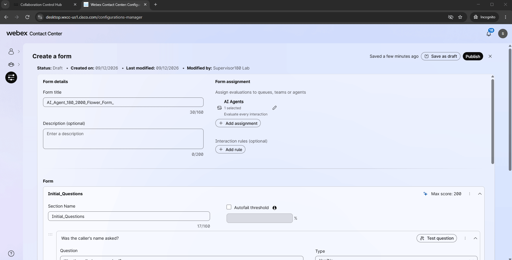
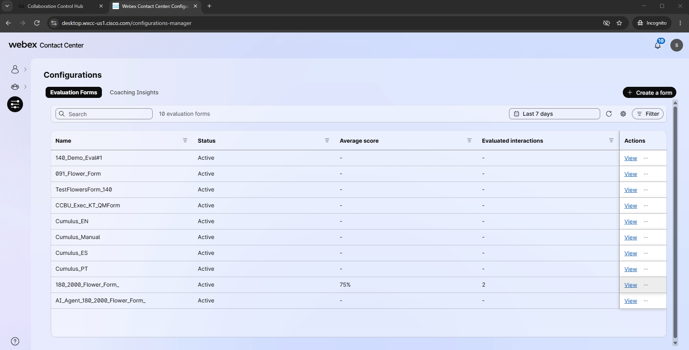

# Mission 2: Configure Evaluation of AI Agent's answers

## Mission overview

Your mission is to:

Create an Evaluation Form with the same requirements used for the human agent: ask the caller's name and the occasion for the flower purchase. Assign the form to your AI Agent, make a test call, and have a conversation with the AI Agent. Then, using the Supervisor Dashboard, evaluate if the AI Agent asked the required questions.

---

## Build

### Task 1. Create Evaluation form for the AI Agent

1. In your Supervisor Desktop (Incognito Window), click on **Configurations** and create a Duplicate of the form that you created for Mission 1 - **<copy><w class="attendee"></w>\_2000_Flower_Form_</copy>**.
   

2. In the Form assignment section, remove the queue. 
   

3. Instead of the Queues, now select that this form will be assigned to your AI Agent. 
   

4. Rename the Form to specify it is for AI Agent tracking. 
   

5. **Publish** the form. 
   

### Task 2. Evaluate the AI Agent using the Evaluation form

1. Place a test call to the number that is associated with your channel **<copy><w class="attendee"></w>\_2000_Channel</copy>**. Talk to the AI Agent and disconnect the conversation. 

2. Go back to your Supervisor Desktop in the Incognito Window, click on **Interactions** and select **Completed**. Look for your call and check the evaluation score. The AI Agent is not configured to ask the caller's name, but it is configured to ask for the occasion for the flowers. So you are expected to see a 50% evaluation score. 
   

<strong>Congratulations, you have officially completed this mission! 🎉🎉 </strong>

