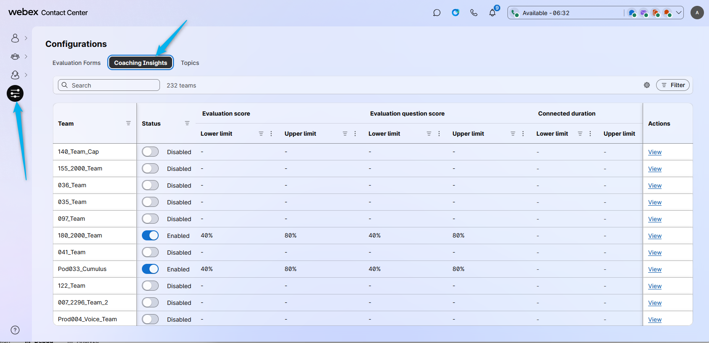
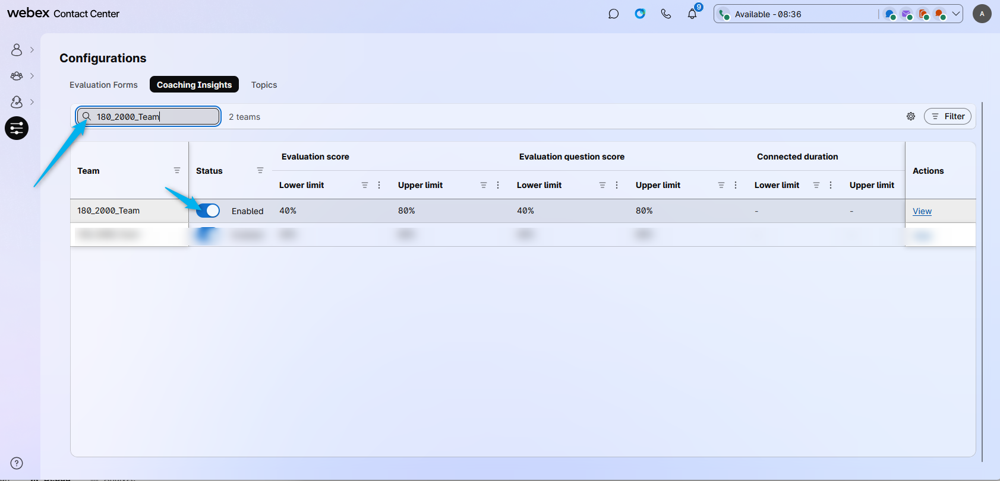
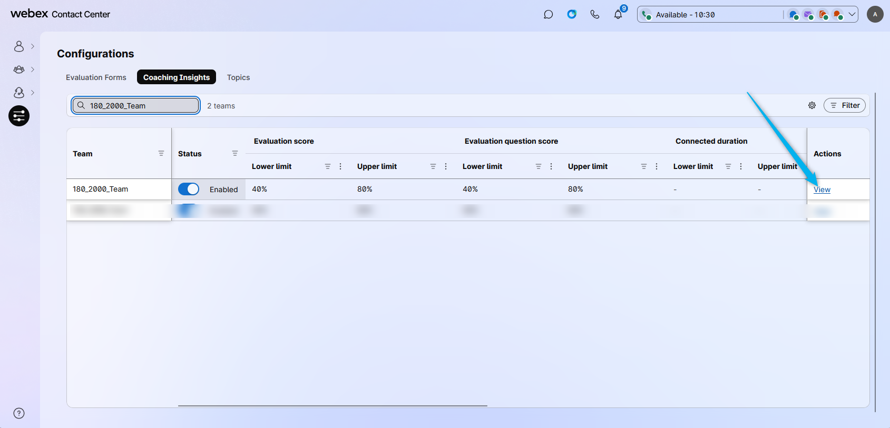
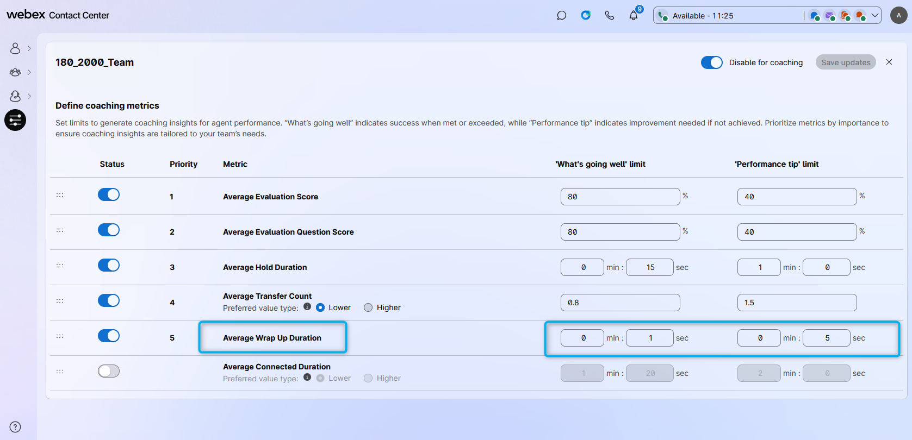
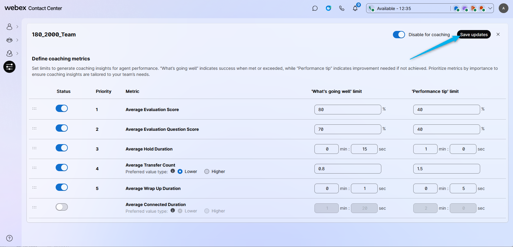
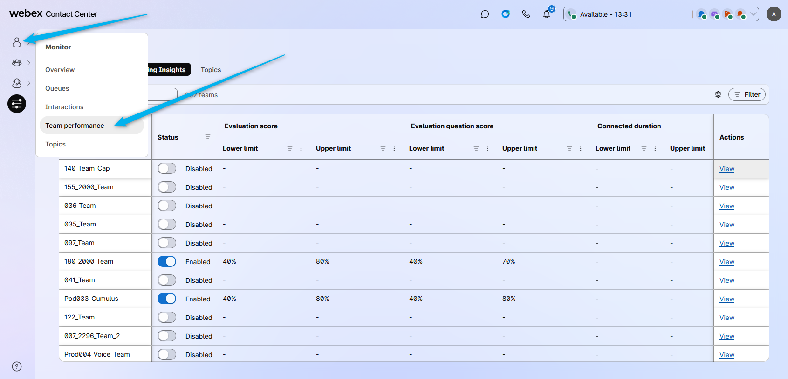
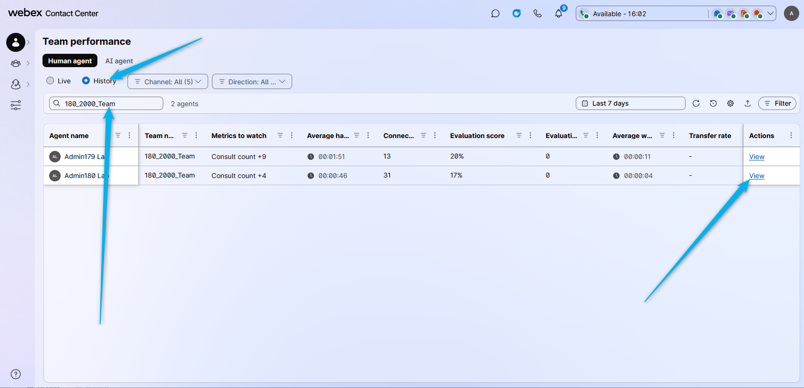
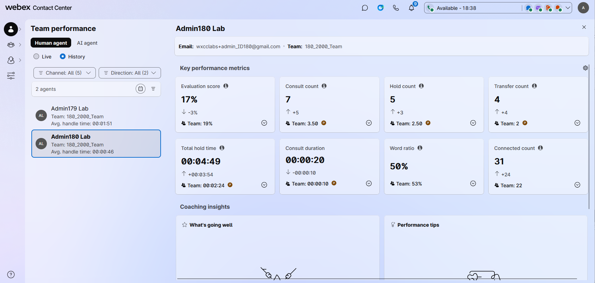

# Mission 3: Configure Coaching Insights

## Mission overview

Your mission is to:

Configure Coaching Insights and review the results. 

---

## Build

### Task 1. Enable Coaching Insights

1. Go to **Configurations** and then select **Coaching Insights**.
   

2. Enable Coaching Insights for your team. You can search for it using your team name: **<copy><w class="attendee"></w>\_2000_Team</copy>**.
   

3. Click on **View**.
   

4. Enable the **Average Wrap Up Duration** and configure it between 1 and 5 seconds. We are doing this in order to trigger a threshold from these requirements so that it will then show in the Team Performance table.
   

5. Click **Save updates**.
   

6. Place a test call, connect it to your agent, and let the call be wrapped up automatically.

7. In the **Monitor** section, go to **Team Performance**.
   

8. Click on **History**. Find your team by searching for **<copy><w class="attendee"></w>\_2000_Team</copy>**. Then click on **View**.
   

9. You will see the Team Performance KPI together with Coaching Insights for every user of the team. In this screenshot, you can see there are 2 users. By clicking on any of them, you will see the specific KPI. 
   

<strong>Congratulations, you have officially completed this mission! 🎉🎉 </strong>

