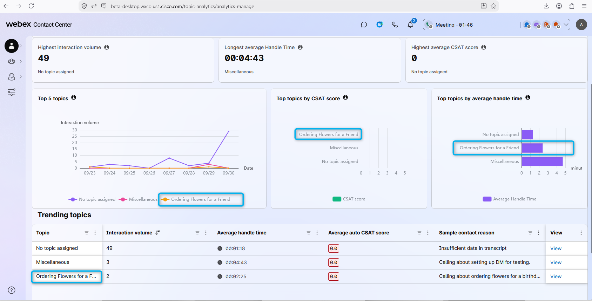
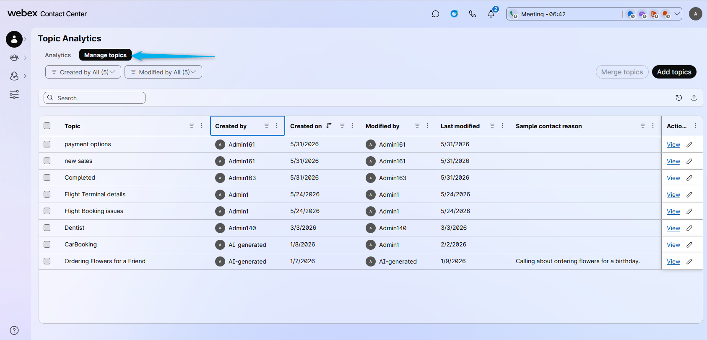
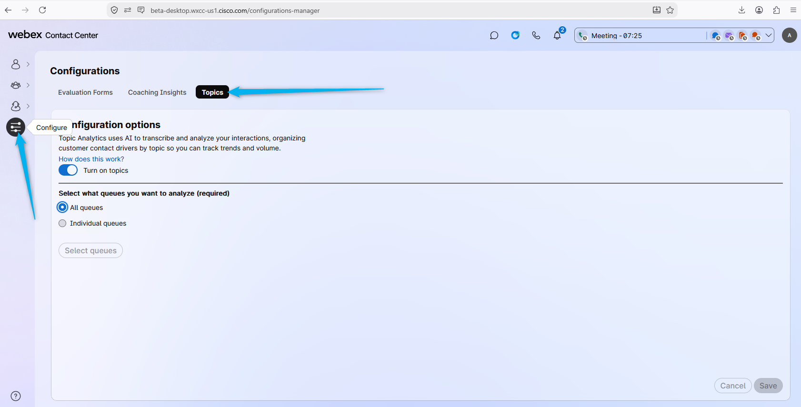
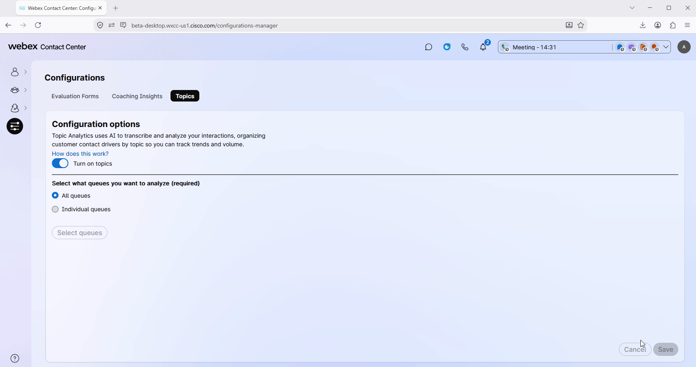
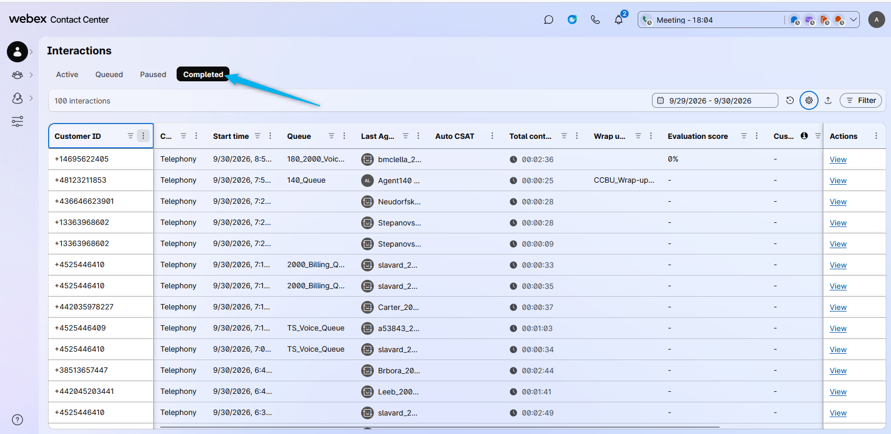
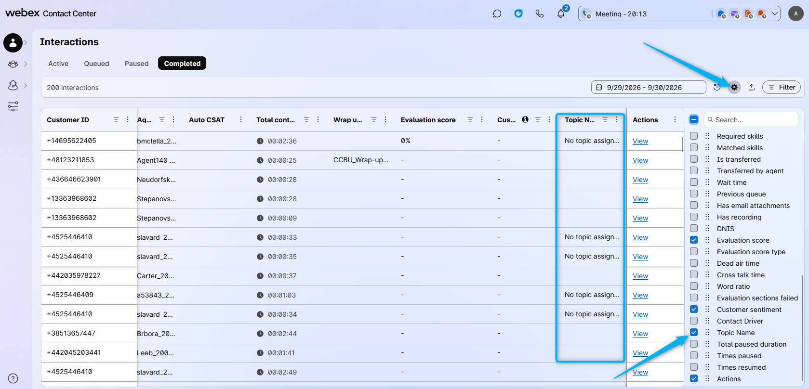
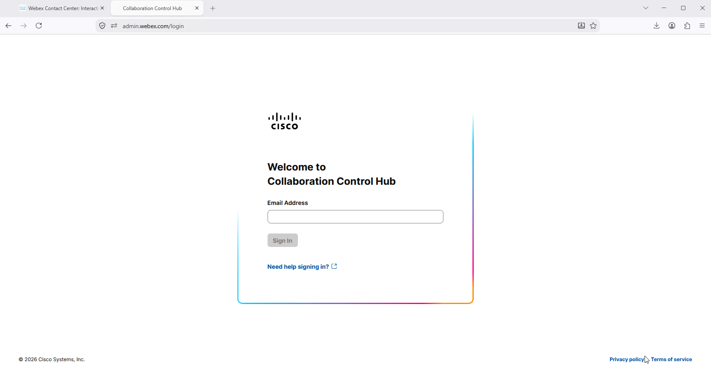
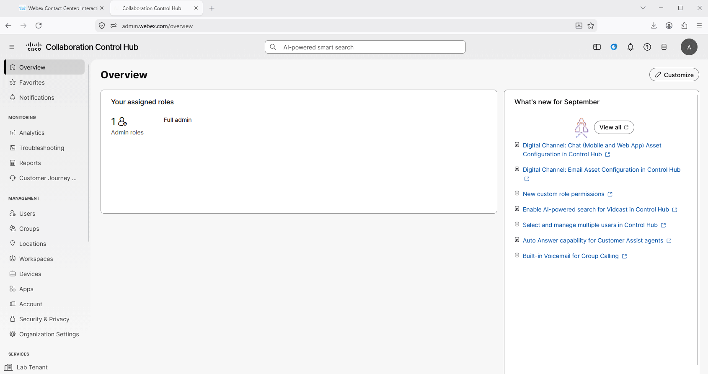
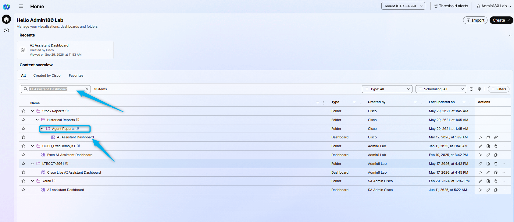
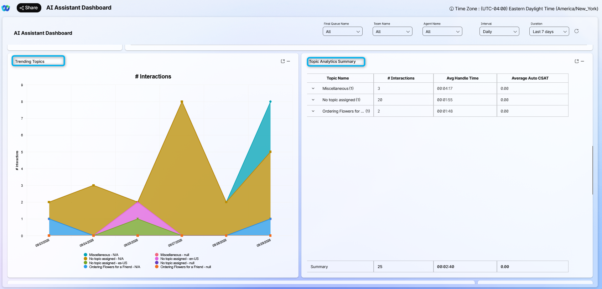

## Feature Description

The all-new Topic Analytics empowers you to discover emerging topics as customer interactions occur, providing instant visibility into evolving trends and concerns. By automatically labeling each interaction, you gain immediate, actionable insights that enable faster, data-driven decisions. This dynamic approach ensures your team can quickly adapt to changing customer needs, optimize operations, and stay ahead of potential issues.

### Task 1. Review the UI for the Real-Time Topic Dashboard for Administrators.

1. Login to [Agent Desktop](https://beta-desktop.wxcc-us1.cisco.com/){:target="_blank"} using your admin credentials.

2. The administrator can review the **Topic Dashboard** to understand why customers are calling the Contact Center and see the areas that can be automated or improved. For example, on the screenshot below you can see some customers are calling to order flowers. This is a potential area that you can automate by using an AI Agent.
   

3. The administrator can **Manage Topics** by merging, deleting, or adding new topics.
   

4. In the **Configure > Topics** section, the administrator can enable Real-Time Topic Analytics for the organization and specify if all or only specific queues should be analyzed using Topic Analytics.
   

### Task 2. Review Real-Time Topic on the Supervisor's Dashboard

Supervisors also have access to the Real-Time Topic data. Read through how to see the Topic Data in the Supervisor Dashboard. Your user is configured with the new feature that allows an admin to see the Supervisor Dashboard. If you have not seen it before, that is expected, as the feature is still in development and was enabled on this tenant earlier for this event.

1. Click on **Monitor > Interactions**.
   

2. Click on **Completed**.
   

3. Click on **Settings** and enable the **Topic Name**. Then you will see the Topic Name associated with the call where the caller was talking to a human agent.
   

### Task 3. Explore Real-Time Topic in Analyzer

1. Open [Collaboration Control Hub](https://admin.webex.com/) and log in if needed.
   

2. Go to the **Contact Center** service and from the **Overview** section open **Analyzer**.
   

3. Search by **<copy>AI Assistant Dashboard</copy>**.
   

4. In this dashboard, you can see the Topic details with a diagram for visual representation.
   

<strong>Congratulations, you have officially completed this mission! 🎉🎉 </strong>

