# Mission 1: Configure Real-Time Assist with Knowledge Base

## Mission overview

Your mission is to:

Create an AI Assistant Skill with a Knowledge Base. The Knowledge Base will contain documents that provide the information the AI Assistant needs to understand the context and provide relevant, accurate suggestions to the agent.

---

## Build

### Task 1. Create AI Assistant skills

1. Now, select **AI Assistant skills** and click on **Create skills**.
   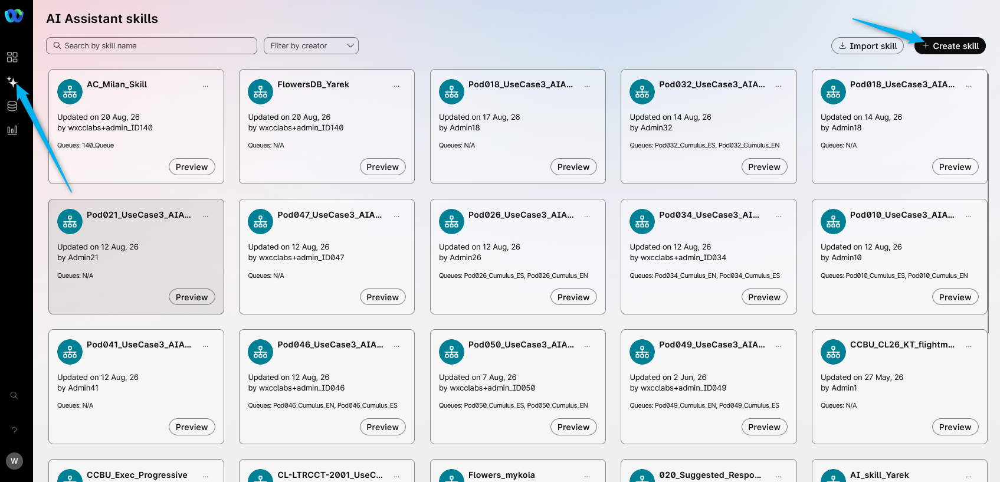

2. Select **Start from scratch** 
   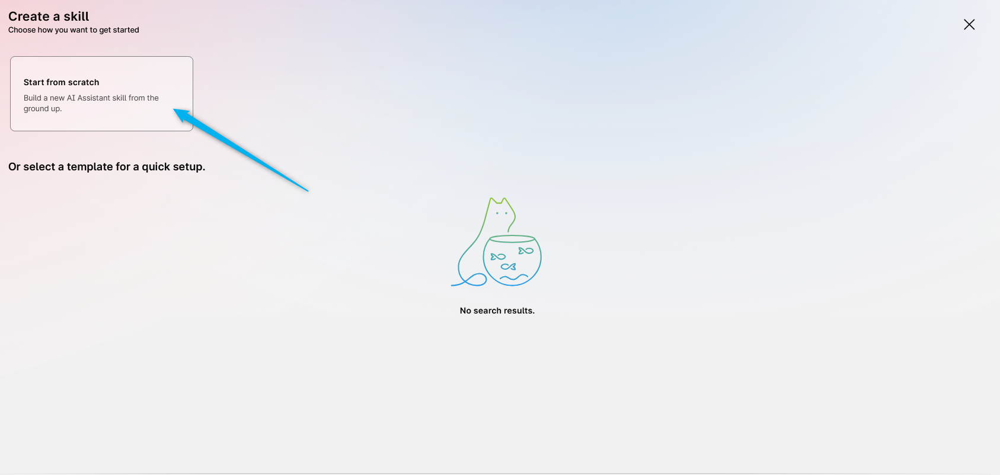

3. Name the skill as **<copy><w class="attendee"></w>\_Suggested_Responses_Skill</copy>**. Describe the goals as **<copy>Answer questions about flower suggestion, flower availability, prices, delivery cost and order status.</copy>**. And then click on **Create**.
   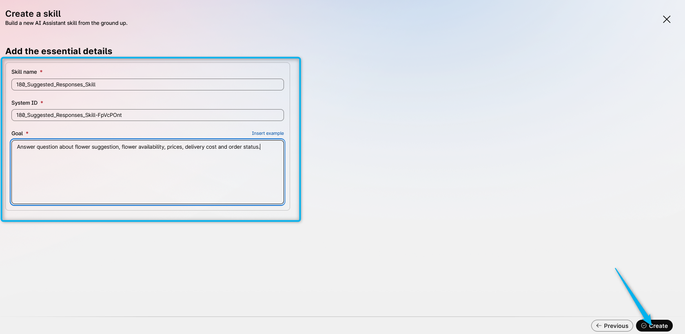

4. Switch to **Knowledge** tab. From the drop-down list, search for **<copy><w class="attendee"></w>\_Suggested_Responses_Plan_B</copy>**. Click on **Save changes**. **Save** and **Publish** the changes.
   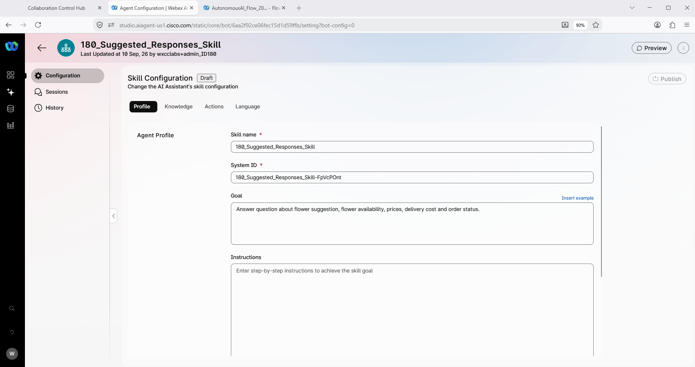

5. Click on **Save changes** and **Publish** the Skill.
   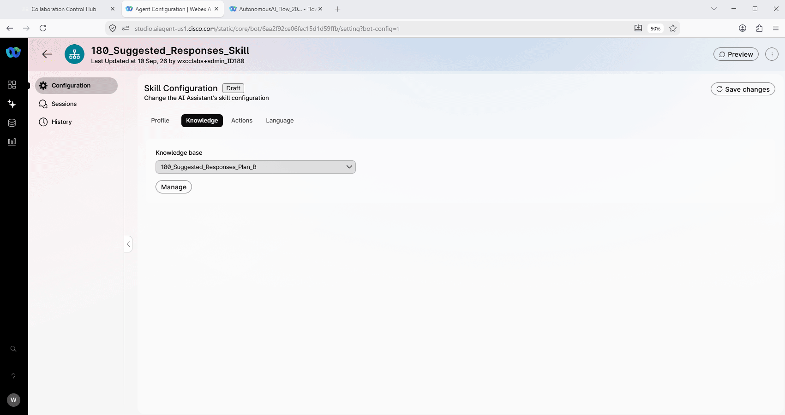

### Task 2. Assign AI skills to your queue

1. In the Collaboration Control Hub, go to Contact Center, scroll down until you see the **AI Features** module. Open it and select **Queue** tab. 
   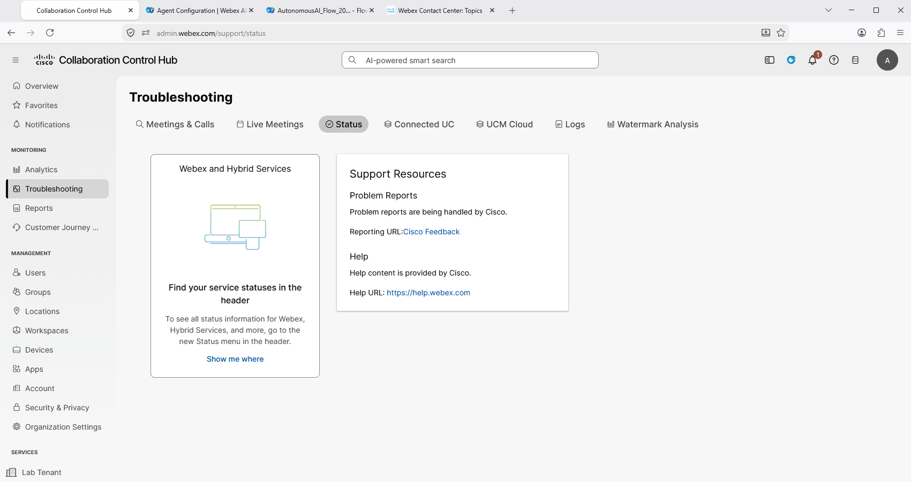

2. Search for your queue **<copy><w class="attendee"></w>\_2000_Voice_Queue</copy>** and open it. Scroll down until you see **Real-time Assist**. Select your Skill **<copy><w class="attendee"></w>\_Suggested_Responses_Skill</copy>** to be assigned to this queue. Then click **Save**.
   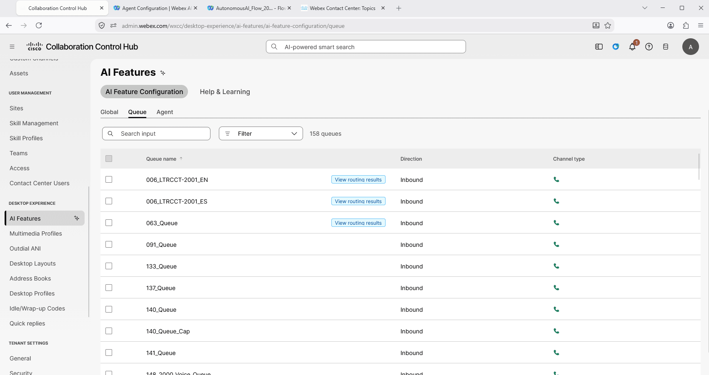

### Task 3. Add "Start Media Stream" block to the voice flow

1. Open your voice flow and click on **Edit**.
   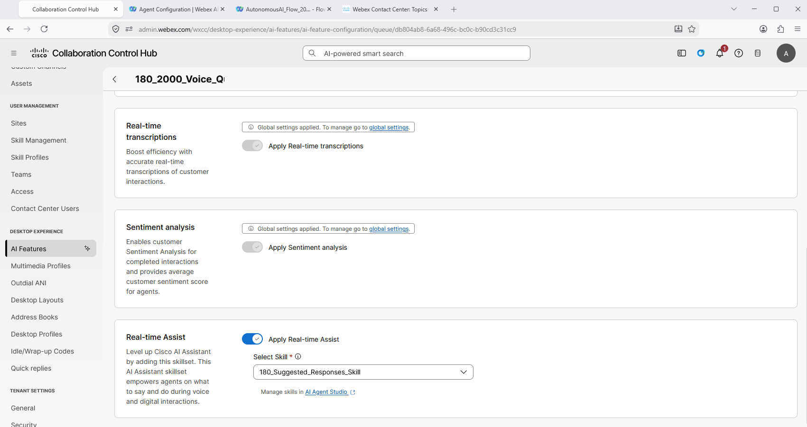

2. Click on **Event Flows**.
   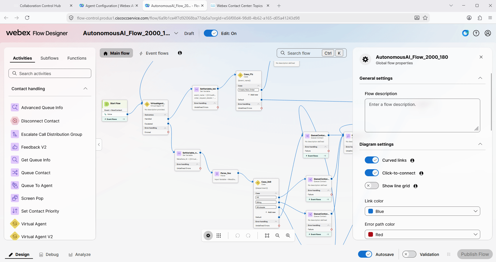

3. Bring **StartMediaStream** node to the flow and connect **AgentAccept** node to this **StartMediaStream**.
   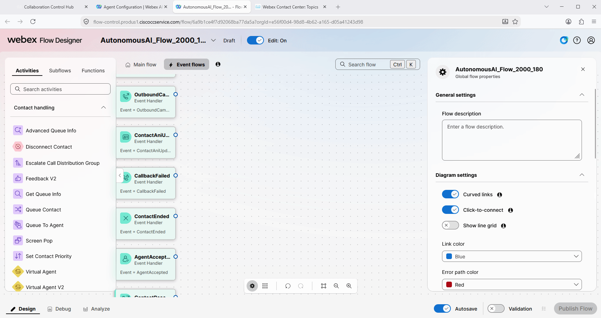

4. Bring **EndFlow** node and connect **StartMediaStream** node to the **EndFlow** node. 
   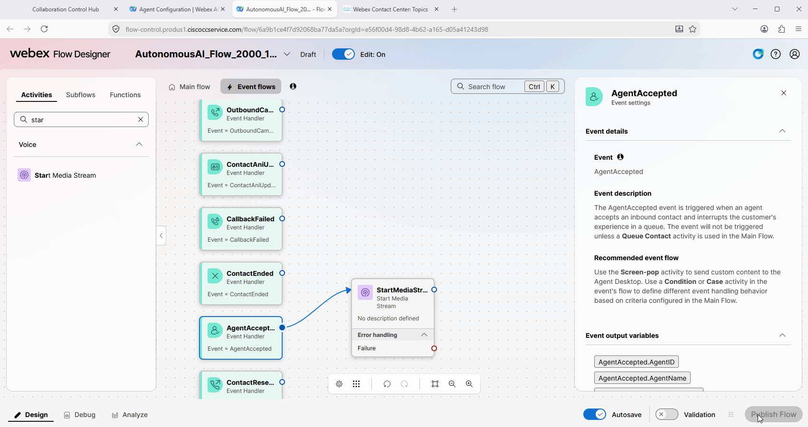

5. **Validate** and **Publish** the flow. 
   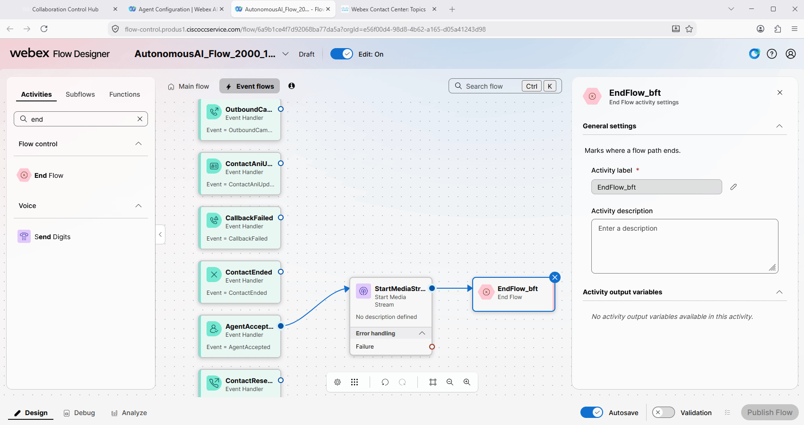

### Task 4. Test Real-Time Assist Feature

1. Make sure your **Agent Desktop** is open and you are in the **Available** status. 
   

2. Call to the number that is related to your **<copy><w class="attendee"></w>\_2000_Channel</copy>**. Once you connect to the AI agent, ask to speak to a human agent.

3. Once the call is connected to your Agent Desktop, first click on Live Transcripts to see the conversation transcripts, then click on the **AI Assistant** module. You will see the option **Get Suggestion**. Select it. As the caller, try to order some flowers. You should see that the AI Agent will suggest flower availability and prices to the human agent based on the Knowledge Base.
   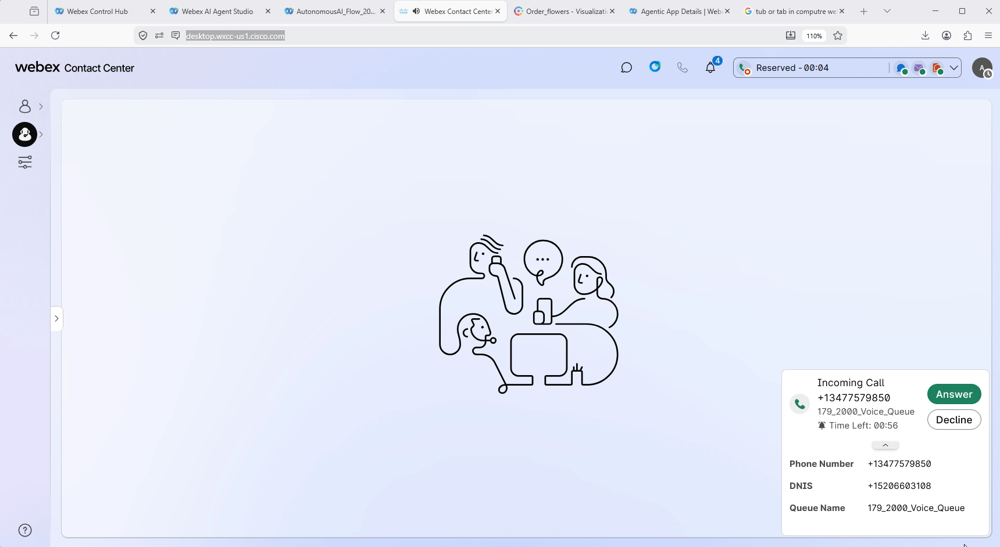

<strong>Congratulations, you have officially completed this mission! 🎉🎉 </strong>

