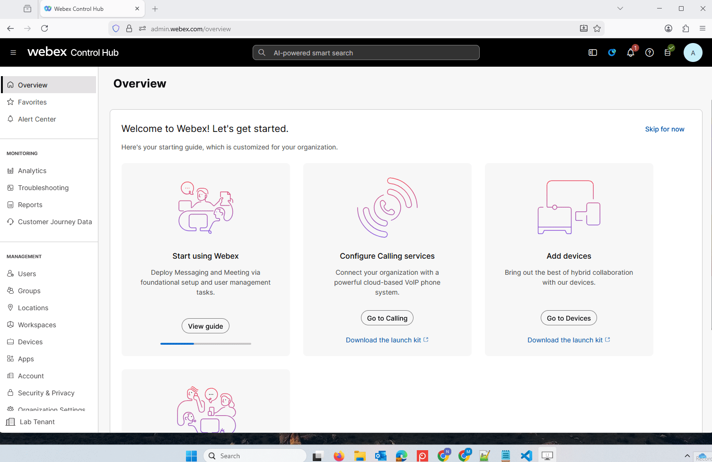
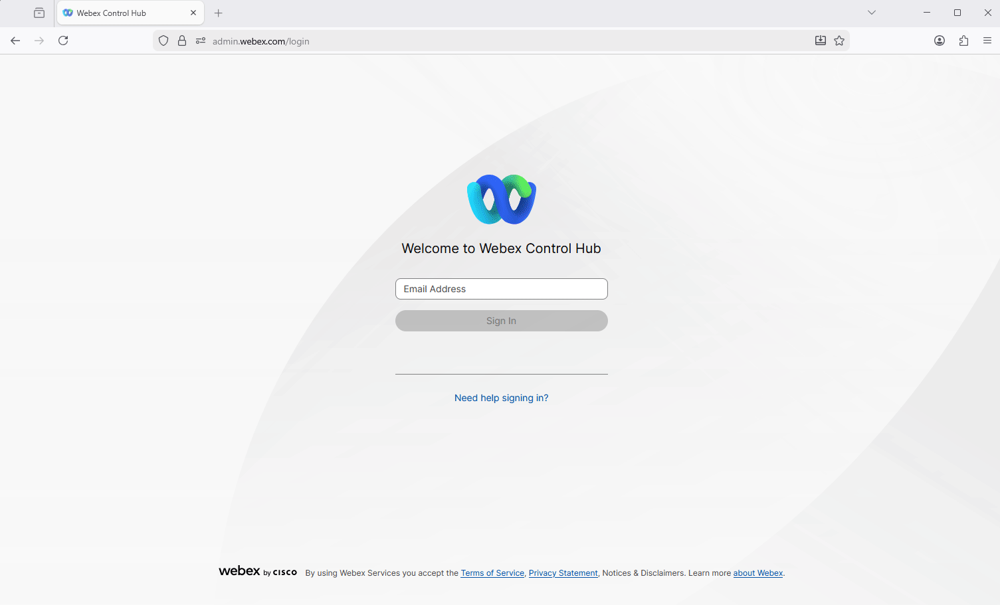
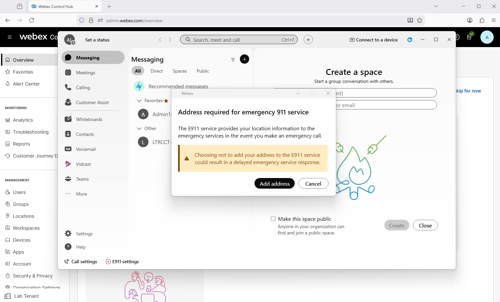
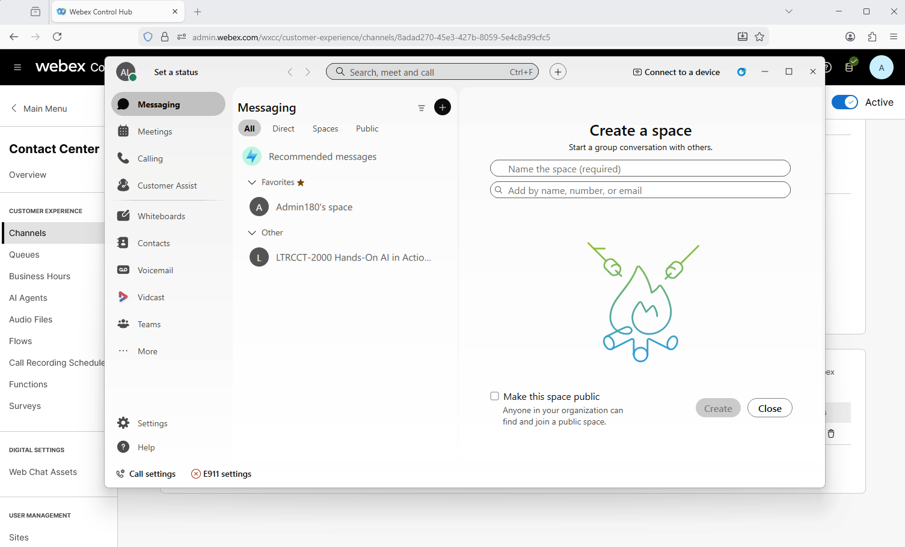

## Know before you start

1. We will be using a shared lab tenant for simulations, meaning all attendees will work within the same Webex Contact Center environment. To avoid conflicts, ensure that any entities you configure are tagged with the Attendee ID assigned to you.
2. The majority of the configuration in Control Hub is already set up, allowing you to focus primarily on configuration of **Webex AI Agent** and other AI features. Of course, there may still be some elements to adjust, but these should be minimal, letting you concentrate on building and refining the flow logic rather than spending time on initial setup.
3. The Human Agent has been configured for you. You will be performing the rest of the configuration for the AI Agent and the integration with the channels.
4. Please ask for help when you need it. You can do so by raising your hand and calling the proctor.

---

### How to place calls:

You can use your cellphone to place inboutn calls to the Contact Center for this lab. 

Or you can follow the step below to login to Webex App and place calls from the Webex App. 

#### Login to Webex App.

1. Open the **Webex App** on your PC.
   

2. **Sign in** using the Admin credentials. (The same credentials you used to login to the Contorl Hub).
   

3. If you receive a prompt to add an Address, click **Cancel**.
   

#### Calling to Contact Center
Place test call to the test number +15206603108 to confirm that you Webex Phone is configured to place calls. You will hear TTS response from the test flow. If you are planning to use your cellphone for testing you can also try to call the number. 
   
