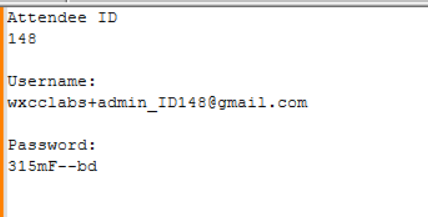
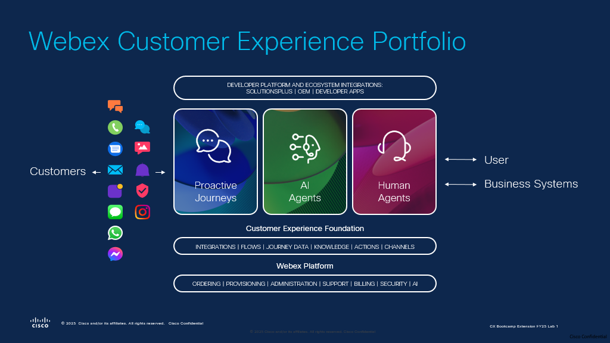

## Get your login credentials

## Get your login credentials

On your screen, look for the file named Credentials_21109_(ID). Open the file; you should see the following information:
   

As the next step, you need to set up your lab for your Attendee ID. In this case, you will all do configuration on the same tenant without interrupting other users.

<!-- Markdown content with embedded HTML -->

    <h3><b>Please submit the Attendee ID below.</b></h3> 
    <h3>All configuration entries in the lab guide will be renamed to include your Attendee ID.</h3>
    <form id="info">
        <label for="attendee">Attendee ID:</label>
        <input type="text" id="attendee" name="attendee" placeholder="Enter 3 digits" required>
        <button onclick="setValues()">Save</button>
    </form>

     

    
Your stored Attendee ID is:<w class="attendee"> No ID stored</w>

## Overview of the lab's Use Case

You are designing a **Webex AI Agent** for a flower shop to assist customers with answering questions and ordering flowers. To support agents and supervisors with the latest AI tools, you will configure **AI Assistant** features.

[Webex AI Agent use case example](https://blog.webex.com/customer-experience/announcing-general-availability-of-webex-ai-agent-paving-way-new-era-cx/){:target="_blank"}

### AI Agent Capabilities

- **Recommending flowers based on customer preferences or occasions**
- **Collecting order details for both standard and custom bouquets**
- **Calculating total price in real time**
- **Gathering delivery information, including address and delivery date**
- **Order confirmations via SMS**
- **Transferring to a specific queue with human agents, when needed for complex inquiries**

### Human Agent Support

- **Enable the agent with call summeries**
- **Provide live transcripts to improve the understanding of the customer's request**
- **Suggest a response to the agent based on the knowledge base**
- **Utilize AI Memory feature to incrase the customer experience over the call**

### Supervisor Support

- **Evaluate agent's and AI Agent's quality of service using Evaluation form**

## Learning Objectives

Welcome to **"Hands-on AI in Action with Webex Contact Center: Building Connected Intelligence from Self-Service to Agent Assistance"**

### 

In this lab, participants will:   
**• Uncover Trends & Opportunities:** Analyze customer conversation data to identify key themes, trends, and automation opportunities for improved service efficiency.   
**• Integrate Intelligent AI Agents:** Utilize Cisco Autonomous AI Agent to build dynamic, context-aware self-service flows that adapt to customer needs in real-time.   
**• Seamless AI-to-Human Collaboration:** Experience smooth transitions from AI agents to human agents, ensuring continuous context and interaction summaries for effective issue resolution.   
**• Enhance In-Interaction Insights:** Experience AI-driven call summarisation and AI Memeory to enhance agent productivity and service quality.  
**• Evaluate Agent's performance:** Learn to leverage AI QM to evaluate the agent's quality of provided service based on the preconfigured template.

## Disclaimer

The lab design and configuration examples provided are for educational purposes. For production design queries, please consult your Cisco representative or an authorized Cisco partner.
Let’s get started and discover how **Webex Contact Center Flow Designer** takes customer experiences from good to great!
